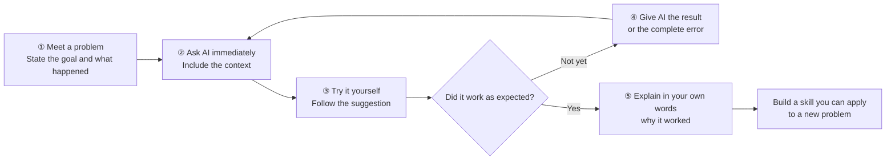

# 初学者 2：学习 AI 编程工具

## 与 AI 主动学习

::: tip 💡 最重要的学习规则：遇到问题先问 AI
从现在开始，把 AI 当作你**寻求帮助的第一选择**。无论是概念不清楚、工具无法安装、不知道命令、程序报错，还是单纯不知道下一步该做什么，**先问 AI，然后自己尝试答案**。

你过去会去问老师、同学或群聊的问题，现在通常可以先问 AI。它响应迅速，能接受追问，并能利用你的错误信息和项目上下文建议下一步操作。不要等到卡住很久才求助，也不要只在希望它写代码时才使用 AI。

**以 AI 为原生的学习不仅仅是借助 AI 完成任务。这意味着在整个学习过程中都要让 AI 参与：问题出现时提问，尝试答案，结果产生新问题时再提问。**
:::

### AI 原生学习循环

与 AI 主动学习并不意味着把任务交给 AI 然后等待。AI 缩短了找到答案的时间，让你可以花更多时间**尝试、检查和理解**。在整个课程中使用这个循环：



### 你可以直接问的问题

| 发生了什么 | 你可以对 AI 说 |
| --- | --- |
| **某个概念不清楚** | “我没有编程背景。用日常的类比解释一下 API，然后给我最小的示例。” |
| **无法安装环境** | “我使用 macOS，并想运行这个项目。先检查我需要什么，然后一步一步指导我，每步都解释它的作用。” |
| **命令报错** | “这是命令和完整的错误信息。先找出最可能的原因，然后给我最小的修复方案。如果需要更多信息，告诉我提供什么。” |
| **不知道接下来做什么** | “我的目标是制作贪吃蛇游戏，游戏界面已经出现。告诉我最小的下一步，以及我如何确认它完成了。” |
| **AI 写的代码你不理解** | “暂时不要再改动代码。逐模块解释上一次修改，以及每部分解决了什么问题。” |
| **无法在两个选项之间选择** | “我是初学者，想快速得到可运行版本。在这些条件下比较选项 A 和 B，并清楚地推荐一个。” |
| **结果与预期不同** | “我希望页面看起来像这样：…；但现在看起来是这样：…。先比较它们，并先修复最明显的差异。” |

::: info 可重复使用的问题模板
**我的目标是…；我已完成…；我尝试了…；实际结果或完整错误是…；请先解释原因，然后给我最小的下一步操作。**

信息越具体，答案就越有用。如果第一次回答没有解决问题也很正常。把新的结果发回给 AI——跟进本身就是 AI 原生学习的一部分。
:::

## 章节概览

<script setup>
import StageAssignmentCard from '@theme/components/StageAssignmentCard.vue'
const duration = '约 <strong>1 天</strong>，可分多次完成'
</script>

<ChapterIntroduction :duration="duration" :tags="['本地开发环境搭建', 'IDE 与 AI 集成开发环境', '高效开发技巧']" coreOutput="你创建的一个原创游戏" expectedOutput="使用 Trae 构建">

之前，我们在 z.ai 上体验过 AI 编程，但网页版有很多限制——你 **不能随时保存工作**，**文件管理困难**，并且 **无法处理复杂项目**。本章将帮助你把开发环境迁移到自己的电脑上，从而 **真正独立地构建东西**。

我们将首先澄清 **IDE 和 AI 集成开发环境 的区别**，以及为什么后者可以 **提高一倍的效率**。然后我们会 **一步步引导你** 使用 Trae 在本地构建贪吃蛇游戏，覆盖从安装到运行的 **完整工作流程**。最后，我们会分享一些与 AI 沟通的 **实用技巧**，帮助你避免常见坑。

完成本章后，你将 **掌握类似专业程序员的开发工作流程**。

::: tip 💡 高级技巧
如果你有一定的编程经验，希望尽早使用更强大的工具，可以参考 [现代 CLI 编程工具](../../stage-2/backend/modern-cli/) 使用命令行进行开发。
:::

</ChapterIntroduction>

<div style="margin: 50px 0;">
  <ClientOnly>
    <StepBar :active="0" :items="[
      { title: '了解环境', description: 'IDE 与 AI 集成开发环境' },
      { title: '动手实践', description: '使用 Trae 构建贪吃蛇' },
      { title: '工具深入探讨', description: '探索 IDE 界面' },
      { title: '沟通技巧', description: '有效与 AI 交流' }
    ]" />
  </ClientOnly>
</div>

## 1. 编写代码需要什么环境和工具

### 1.1 思维方式转变：有疑问，先问 AI

在介绍各种环境和工具之前，有一个重要提醒：你需要**改变你的思维习惯**。

在传统编程学习中，如果你需要安装 Python、配置 Conda 或解决 npm 安装失败问题，你通常会打开搜索引擎，找到教程，然后一步步跟着操作。如果过程中出现错误，你会搜索错误信息，然后反复尝试。

错！❌

在 AI 时代，尤其是使用 AI 集成开发环境 时，请记住一个核心原则：**对于任何任务，你都可以先问 AI，或者让 AI 为你完成。**

- **不知道如何设置环境？** 只需在侧边栏问 AI：“我想写 Python。请检查 Python 是否已安装，如果没有，请帮我安装。”
- **网络卡住？** 如果安装依赖一直转圈或报错，只需把错误交给 AI：“下载失败了。是网络问题吗？你能帮我切换到其他镜像源吗？”
- **记不住命令？** 不必记住 Git 或 Conda 命令。只需告诉 AI：“帮我创建一个名为 demo 的新虚拟环境。”

### 1.2 为什么你需要环境和工具

从“尝试写几行代码”到“构建可长期维护的项目”，需要完全不同的环境和工具。

理论上，你可以用系统自带的记事本写代码，但问题很快就会出现：

- **所有代码都是纯黑色文字** —— 关键字、字符串和注释都混在一起，难以一眼看清结构
- **没有智能提示** —— 每个字都得手动输入，一个小错误就需要反复检查代码
- **文件变得混乱** —— 在几十个文件之间切换，通常找不到需要编辑的行
- **调试靠猜测** —— 当程序崩溃时，你不知道哪里出错，只能逐行添加打印语句

这就是你需要 IDE（集成开发环境）的原因。它可以对代码进行不同颜色显示，输入时提供自动建议，按项目组织文件，并让你逐步追踪错误 —— 让开发更加高效且减少错误。

## 2. 什么是 IDE，为什么需要它

::: info 预阅读提示
如果你还不熟悉 IDE 是什么或者每个界面元素的功能，建议先阅读 [IDE 基础](/en/appendix/2-development-tools/ide-basics) 了解基本概念和常用功能。
:::

在编程早期，我们只需要一个简单的文本编辑器和语言处理器。但随着项目复杂度增加，开发者迫切需要一个能够高效管理文件、支持语法高亮和调试的工具 —— 于是集成开发环境（IDE）诞生了。

你可以把IDE看作专门设计用于“编辑、管理、运行和调试”代码的程序。早期IDE看起来非常“原始”，几乎完全通过键盘操作。

![](../../../zh-cn/stage-1/introduction-to-ai-ide/images/image1.webp）！[](../../../zh-cn/stage-1/introduction-to-ai-ide/images/image2.png）

终端接口 — 图片来源：https://en.wikipedia.org/wiki/File:Emacs-screenshot.png

知名且成熟的“内置集成开发环境”如`Vim`常用于远程服务器操作。

![](../../../zh-cn/stage-1/introduction-to-ai-ide/images/image3.webp）

为了提高效率，我们需要支持鼠标交互的现代IDE，通常包括：

- **源代码编辑器**：语法高亮，自动补全。
- **构建与运行工具**：内置编译器/解释器。
- **调试器**：断点调试，变量检查。

现代IDE通常还内置了Git等工具。最受欢迎的是Microsoft的**[Visual Studio Code （VS Code）]（https://code.visualstudio.com/）**，它轻量且可扩展。虽然也有像JetBrains套件这样的专业IDE，但VS Code对初学者最友好。

![](../../../zh-cn/stage-1/introduction-to-ai-ide/images/image4.webp）

VS Code 的核心理念是“一切都是一个插件”。通过它的插件系统，它支持多种语言——安装 Python 插件，它变成 Python IDE，安装 C 插件，它变成 C IDE。没有插件，它只是一个高级文本编辑器。


不过，VS Code 并不是 AI 功能最强大的 IDE。对于需要大量 AI 辅助编码的场景，我们通常希望使用“更智能、更高效”的工具——一个好的 AI 集成开发环境 可以显著节省编写代码和修复错误的时间。下面我们将介绍几款流行的 AI 集成开发环境，你可以根据个人偏好选择任意 AI 集成开发环境。

由于 VS Code 是开源的（任何人都可以下载源代码并自行编译），目前市场上绝大多数 AI 集成开发环境 都是基于 VS Code 构建的。所以你无需担心“要学习很多不同的 IDE”——**只要你熟悉 VS Code 的基本操作**，迁移到这些 AI 集成开发环境 并不需要从零开始。

一般来说，AI 集成开发环境 之间的差异主要体现在四个方面：价格；可用模型类型（某些高级模型在特定地区可能受限）；智能体 能力（在协助编码方面的智能程度和能力）；以及速度和性能。你可以根据自己的测试结果选择——最好的工具就是最适合你的那个。

> 典型的 AI 集成开发环境 通常具有以下核心能力：
>
> - 智能代码生成与补全：在传统 IDE 中，我们通常输入几个字符来自动补全变量或函数名。在现代 AI 集成开发环境 中，你可以编写几行伪代码或简单描述你的需求，IDE 就会自动补全完整逻辑，甚至根据指令生成大块代码。
> - 代码理解与问答：IDE 可以理解并回答关于特定代码片段、文件，甚至整个项目目录结构的问题。
> - 代码重构与优化：IDE 可以根据你的意图重写或优化指定代码片段的实现逻辑。
> - 自动生成测试：IDE 可以为不同的函数和模块自动生成测试代码，方便你进行针对性测试。
> - 智能体 式任务执行：智能 智能体 可以自动生成、构建、安装、运行和修改代码，在许多任务中部分替代初级软件工程师的工作。

::: details Antigravity

### [Antigravity](https://antigravity.google/)

反重力（Antigravity）是谷歌于2025年11月与Gemini 3一同发布的全新AI集成开发环境（IDE），采用“Agent-First”开发模式。与传统的AI辅助编码不同，Antigravity将AI代理作为“主动执行者”，能够直接操作编辑器、终端、浏览器及其他工具，承担更多的“执行”、“规划”和“验证”工作。开发者只需表达高层意图，代理就会自动拆解任务、制定计划、执行代码、运行测试并生成结果。它支持多模型切换，包括Gemini 3 Pro、Claude Sonnet 4.5等。目前处于公开预览版，支持Windows、macOS和Linux。
:::

::: details Trae

### [Trae](https://www.trae.ai/)


Trae是由字节跳动开发的AI编程助手，支持100多种编程语言，并可集成到主流IDE中。其功能包括：从自然语言生成代码、自动调试、将设计原型转换为React/Vue组件。2025年8月更新后，Trae新增了智能依赖导入、重命名建议、任务清单管理等功能。SOLO模式也开始支持后端代码生成及技术架构文档编辑。
:::

::: details Cursor

### [Cursor](https://cursor.com/)

Cursor是由Anysphere开发的AI代码编辑器，基于定制的VS Code构建，优化重点是大规模代码库和多文件协作场景。它支持GPT-4o、Claude 3.7等模型。2025年推出的Claude Max模式可处理数百万行代码的项目。Pro版本取消了请求限制，非常适合复杂的企业项目。

目前，Cursor可以说是拥有图形界面的AI 集成开发环境中整体体验最优的之一，拥有庞大用户基础和频繁的功能更新。其最大缺点是价格较高——Pro版本约为每月20美元。


:::

::: details Qoder

### [Qoder](https://qoder.com/)

Qoder是阿里巴巴的AI 集成开发环境，强调“透明协作”和“增强上下文工程能力”。它支持通过Action Flow将任务拆分为多个步骤，并实时跟踪AI执行情况。还支持多模型动态路由和任务状态机管理，非常适合中大型项目的架构治理和对遗留系统的“逆向工程”分析。


:::

::: details CodeBuddy

### [CodeBuddy](https://www.codebuddy.com/)

CodeBuddy是腾讯云的AI编程工具，强调中文指令支持和企业级合规能力。它提供代码补全、批量代码审查和多模型切换。其Craft代理可以进行多文件代码生成及API集成。企业版支持私有部署，并通过了三级安全认证，适用于金融、医疗等对数据安全要求高的行业。


:::

::: details VS Code   Cline

### VS Code   [Cline](https://cline.bot/)

Cline 是一款面向 VS Code（Visual Studio Code）的 AI 编程代理插件，可以通过配置不同的 API 端点灵活切换不同的大型模型。Cline 支持多模态输入、MCP 工具扩展和成本监控，所有操作执行前都需要用户确认。它非常适合快速验证想法或与现有开发流程集成。基础功能免费，企业版支持在私有环境中部署模型。

![](../../../zh-cn/stage-1/introduction-to-ai-ide/images/image13.webp）

![](../../../zh-cn/stage-1/introduction-to-ai-ide/images/image14.webp）
:::

::: 详情 Kiro

### [Kiro]（https://kiro.dev/）

Kiro 是 AWS（亚马逊云服务）开发的 AI 编程集成开发环境（IDE），深度集成于 Amazon Bedrock 和 AWS 云服务生态系统。它支持包括 Claude 和 Nova 在内的多个大型模型，特别适合需要与 AWS 云服务紧密集成的开发场景。Kiro 提供智能代码生成、自动化测试以及与 AWS 资源（如 Lambda、S3、DynamoDB）的无缝集成，为云原生应用开发带来独特优势。

> **注意**：如果你想使用 Anthropic Claude 模型，你需要使用 Cursor、Kiro 或 Antigravity 作为你的 IDE。这些 IDE 与 Anthropic 有官方合作或深度集成，提供更稳定、更完整的 Claude 模型体验。
:::

<div style=“margin： 50px 0;”>
  <ClientOnly>
    <StepBar ：active=“1” ：items=“[ { 标题：”理解环境“，描述：”IDE vs AI 集成开发环境“ }， { 标题：”实践实践“，描述：”用 Trae 构建蛇“}， { 标题：”工具深度探究“，描述：”探索 IDE 界面“}， { 标题：”沟通技巧“，描述：”有效与 AI 交流“ } ]” />
  </ClientOnly>
</div>

## 4.动手操作：用AI集成开发环境本地构建蛇类游戏

之前的部分主要讨论“概念”和“差异”。在本节中，我们将通过一个完整的实践练习，将抽象概念转化为具体行动：**创建一个新的空文件夹 -> 用AI集成开发环境打开它 ->侧边栏的聊天，让它用React从零开始构建一条蛇类游戏。** 这里我们以Trae为例，首先需要安装它并理解Trae是什么。

::: 提示 💡 快速提示：网页到本地无缝过渡
如果你之前在 z.ai 或其他基于网络的AI编程平台上开发过项目，可以直接将代码下载到本地机器，并用AI集成开发环境打开以继续开发。这样你可以保留之前的工作，同时享受本地IDE更强大的AI辅助。

步骤很简单：
1. 在像 z.ai 这样的平台上点击下载按钮，将项目保存到本地
2. 解压后用像 Trae/Cursor 这样的 AI 集成开发环境 打开文件夹
3. 继续在侧边栏与AI聊天，迭代并改进你的项目
:::

### 4.1 准备：安装并了解Trae

#### 4.1.1 什么是Trae

Trae的全名可以理解为“真正的AI工程师”。这是一个由字节跳动开发的自适应AI集成开发环境（IDE）。它建立在流行的VS Code之上，这意味着如果你已经熟悉VS Code，会发现Trae的界面布局和基本操作非常熟悉且舒适。

Trae 的核心目标是成为开发者的“智能编程伙伴”。通过深度 AI 集成，它可以自动处理大量重复工作，为你提供更直观、高效的开发体验。它不仅仅是一个“代码补全工具”——而是旨在在整个开发工作流程中提供辅助，从创建项目、编写代码、调试、测试到部署。 

#### 4.1.2 安装 Trae 

Trae 分为国际版和中国版。国际版需要访问海外网络，但可以使用最新的海外模型，如 GPT-5。中国版主要支持最新的国内大模型，如 GLM、Qwen、Kimi 等。

国际版下载: https://www.trae.ai/ 
中国版下载: https://www.trae.cn/ 

##### Trae 价格与使用选项 

::: info 💡 版本选择建议（初学者推荐中国版）
- **对于初学者，我们强烈建议下载中国版（CN 版，trae.cn）** — 目前提供更好的整体体验并且免费使用，无需海外网络
- 如果你需要使用 GPT-5 等海外模型且网络条件允许，可以选择国际版
- 如果你已有第三方模型 API Key，通过连接第三方模型可以灵活控制成本
:::

> 💡 **当前推荐：使用 OpenRouter 免费模型进行测试**
>
> 截至本教程撰写时间（2026-02-12），你仍然可以免费尝试 StepFun 的模型。详细连接模型方法请参见下文 4.2 节 `stepfun/step-3.5-flash:free`。

关于 Trae 的成本和使用选项，有几种选择：

- **中国版 CN（强烈推荐）**：基础使用免费，目前提供的整体体验优于国际版——非常适合初学者。由于用户量大，有时你可能需要排队。
- **国际版**：订阅费用约 $3 / 月，可访问 GPT-5 等海外模型，但需要海外网络。
- **第三方模型接入**：如果你已有国内大模型提供商（如 DeepSeek、通义千问、Kimi 等）的 词元 API，可以通过 Trae 的第三方模型配置连接这些 API。大型云服务提供商（如阿里云、腾讯云、百度云等）通常提供 Coding Plan 订阅，允许你以更优惠价格使用其大模型 API。这样你可以自由选择偏好的模型，同时控制成本。

我们建议初学者从免费中国 CN 版开始（下载: https://www.trae.cn/），目前提供更好的体验且完全免费。如果遇到排队问题或需要更稳定的服务，可以考虑连接第三方模型并购买对应云服务商的 Coding Plan。

#### 4.1.3 Trae 界面概览 

在界面设计上，Trae 与我们日常使用的 VS Code 非常相似：经典的三栏布局，左侧为文件浏览器，中间为编辑区，右侧为扩展面板。


右侧边栏是 Copilot 交互窗口，也可以理解为 智能体 窗口。如果你没有立即看到它，可以点击 Trae 右上角的边栏图标来打开。


打开侧边栏后，你会看到 `Builder` 选项——这就是代理模式。简单来说，它就像 z.ai 的“本地版本”，可以操作你的本地环境、安装运行环境、打开网页等。


点击“Builder”后，你会看到“聊天模式”和“带 MCP 的 Builder 模式”:

- **聊天模式**：主要用于聊天当前文件夹中的代码，或者作为一般的聊天模型。（你可以通过左上角的“文件”菜单打开一个文件夹，并在该文件夹内进行编辑。在这种情况下，Builder 创建或修改的任何文件都只会发生在此文件夹内。）
- **带 MCP 的 Builder 模式**：为代理提供更多可用工具（例如将语言模型与其他软件连接、查询天气等）。你可以简单理解为：MCP 让语言模型更容易调用各种外部工具。


在下方区域，你还会看到模型选择选项——点击即可更改当前大型模型。在中国版本中，你可以选择国内模型，如 Kimi k2 或 GLM。如果使用 Trae 的国际版本，你也可以选择海外模型，如 ChatGPT 或 Claude。不过，由于国内大型模型发展非常快，Kimi、Qwen、GLM 等在很多任务上已经能提供接近 Claude 3.5 或 3.7 的体验，这对于日常开发已经足够。这里并没有严格要求必须使用国际版或中国版。

**请注意，我们不建议使用自动模式（自动选择模型）。对于国际版本，我们建议使用 Gemini 或 GPT 模型。对于中国版本，我们建议尝试国内模型，如 Kimi k2、Minimax 或 GLM。** 不同模型适用于不同的使用场景——没有哪种一定更优的教条规则。当某个模型遇到瓶颈时，可以尝试切换到另一个模型。通过多次测试，你会找到最适合自己工作流程的最佳方案。


这就是 Trae 的简要介绍。接下来，让我们回顾之前在 z.ai 上做的内容，并尝试在 Trae 中完成同样的操作。

### 4.2 第一步：创建一个空文件夹并用 AI 集成开发环境 打开它

在开始之前，我们首先需要准备一个干净的项目工作目录。
本节示例中，你可以在本地计算机上创建一个名为 `snake-game-react` 的新空文件夹。

然后，打开你已安装的 AI 集成开发环境，在启动界面选择“打开文件夹”，将空文件夹导入为项目根目录。你也可以将文件夹直接拖入 IDE 窗口打开。此时，左侧的文件资源管理器中不会显示任何代码文件，这表示我们正从一个完全空白的项目状态开始。

::: details 📚 可选：连接云服务提供商的 API 或 Coding Plan

本节介绍如何连接云服务提供商的 API 或 Coding Plan，以便更稳定和频繁地调用模型。Trae 集成的截图示例在最后提供。

**什么是 Coding Plan**

编码计划是由主要云服务提供商提供的一种订阅。购买后，你可以**在一定时间内无限制或高频率**使用该供应商的大型模型API。与按令牌计费相比，编码计划更像是“月费套餐”——你支付固定费用，可以自由使用，无需担心每次通话费用。

**为什么要购买编码计划**

你可能会问：既然可以通过API直接调用大型模型，为什么还要购买编码计划？主要原因是：**无限使用**。编码计划的核心优势是你可以随时调用大型模型，无需担心成本爆炸或不断检查计费。

**推荐的国内云服务编码计划**

以下是主要国内云服务提供商推荐的编码计划选项：

- Zhipu AI（大模型计划）：https://bigmodel.cn/glm-coding
- Volcengine（字节跳动云AI计划）：https://www.volcengine.com/activity/codingplan

> 💡 **你也可以直接连接大型模型API**
> 除了编码计划外，你还可以通过添加模型直接连接各种模型API。你可以参考下面的方法，将OpenRouter StepFun免费API连接到Trae。测试显示它满足了基本的编程需求。
> 如果需要充值，建议先从少量（例如10元人民币）开始，看看能用多久，比如像DeepSeek这样性价比高的型号。

**如何连接编码计划**

连接编码计划非常简单，只需几分钟：

1. 访问您所选云服务提供商的网站（例如，Zhipu AI： https://bigmodel.cn/glm-coding，Volcengine： https://www.volcengine.com/activity/codingplan）
2. 注册账户并登录
3. 查找“定价”或“编码计划”页面
4. 选择适合你的计划并完成付款
5. 付款后，您将收到API密钥或套餐ID

::: 提示 🎯 定制模型推荐

在Trae中连接自定义模型时，我们**建议默认使用OpenRouter方法**。OpenRouter提供了一个统一的API接口，方便连接多个大型语言模型。

**截至2026年2月12日，你仍然可以使用StepFun的免费API：**

- **`stepfun/step-3.5-flash:free`**：StepFun提供的免费模型，可直接在Trae中连接。

**其他免费型号：**

- **`openrouter/free`**：默认使用免费LLM API的模型选项。你可以直接在Trae的自定义模型集成中使用（只需输入模型ID），体验AI编程功能且无需额外费用。

这些免费选项非常适合初学者。在决定使用生产环境之前，你可以通过这些免费选项熟悉 AI 集成开发环境 的工作流程。

**可选：连接大型模型API（以DeepSeek为例）**

1. 访问DeepSeek平台：https://platform.deepseek.com/usage
2. 注册账户并登录
3. 在充值页面购买10元人民币代币套餐
4. 充值后，在 API 密钥页面创建并复制 API 密钥
5. 在Trae中，点击**“添加模型”**，找到DeepSeek，选择对应模型，输入API密钥开始使用

通过下面的界面，你可以成功添加模型（注意：选择模型选项后，**请务必滚动到最底部**——有一个“自定义模型”选项。点击它输入模型ID，输入推荐的型号ID，如`stepfun/step-3.5-flash:free`。也点击下方的“获取密钥”访问官方网站，获取相应的API密钥。）

![](../../../zh-cn/stage-1/introduction-to-ai-ide/images/index-2026-02-12-14-14-51.webp）

![](../../../zh-cn/stage-1/introduction-to-ai-ide/images/index-2026-02-12-14-15-29.webp）
:::

### 4.3 第二步：在侧边栏聊天，让AI用React设计蛇类游戏

接着，打开AI聊天侧边栏：通常按`Ctrl+L`或点击右侧聊天图标。然后输入清晰提示：

> 请使用React架构实现一个蛇类游戏，包括键盘控制、吃东西时的生长和得分，以及在撞墙或撞墙时显示“游戏结束”并支持重启。实现后，请帮我启动这个项目。如果没有安装任何程序环境，请自动安装缺失的环境。

在这个过程中，你需要意识到AI不仅仅是一个聊天模型——它可以帮助你操作本地环境：创建文件、安装依赖、执行启动命令等。你可以用自然语言直接描述你的目标，让AI决定执行哪些具体命令以及如何组织代码。

如果执行过程中出现问题，AI会在对话中显示错误和解决方案。你可以让它通过对话持续调整，而不必自己记住所有命令细节。

::: 警告 ⚠️ 重要提示
如下图所示，**有时AI代理在执行过程中会暂停，因为需要等待你输入交互信息**，比如输入创建的名称，或按回车确认命令执行，或点击命令执行。通常我们直接按回车。如果你不确定这一步需要什么，可以截取当前界面的截图，询问大型模型应该执行哪些操作。
:::

如图所示，这里我们需要点击“运行”来确认：


我们可以点击右下角的对勾来确认代码更改，或者点击 `Cancel` 按钮取消更改。也可以点击“2 个文件需要审核”区域来展开查看修改后的代码。

还值得注意的是，由于代码修改不一定总是正确的，我们需要知道所有 IDE 智能体 都支持代码回滚。例如，如果我在此处不小心进行了错误的修改操作，或者此次操作结果不理想，在修改完成后，我们可以返回输入框区域并点击回滚按钮，将操作回到修改前的状态。你可以修改输入文本进行另一操作：


### 4.4 第 3 步（可选）：向 AI 询问代码实现细节

当贪吃蛇游戏正常运行时，如果你还不熟悉前端或 React，可以继续在同一个聊天窗口中，让 AI 以尽量口语化的方式指导你理解代码。你不需要切换工具或刻意查阅文档——只需持续针对当前项目提问即可。

一个实用的做法是先让 AI 给出“游戏如何移动”的整体解释，然后再拆解到具体细节。例如，你可以直接问：

> “请从上到下一步步解释这款贪吃蛇游戏是如何移动的？尽量使用少量技术术语。”


然后根据它的回答，对关键点进行追问，例如：

> “用什么数据结构记录屏幕上蛇身体的每一节？能举个类比吗？”
> “‘每隔一段时间移动一次’是如何控制的？这段逻辑在代码的哪一部分？”
> “当蛇吃到食物时，你采取了哪些步骤？判断吃到食物的逻辑在哪？”
> “在代码中哪里判断撞墙和撞到自己？”

如果你看到某个文件（例如 `SnakeGame.tsx`），但完全不知道它在做什么，也可以直接让 AI 分段解释：

> “请将 `SnakeGame.tsx` 分为几个功能模块解释：每个模块大致负责什么，用更简单的语言说明。”

在这一轮对话中，你可以将任何不理解的词汇作为追问的切入点，例如：

> “你刚才说的‘state’具体指什么？能用生活中的例子解释吗？”
> “这里的 ‘timer’ 主要作用是什么？如果去掉会怎样？”

通过这种方法，你的目标不是一次性记住所有概念，而是先理解三件事：游戏中存在哪些核心数据（蛇、食物、得分、游戏状态等）、这些数据何时变化（移动、吃饭、游戏结束等），以及对应每个变化的代码小段。一旦这三点清晰，你基本就能理解这段代码的主要逻辑。

### 4.5 步骤4：让AI让界面看起来更好

首先，提醒初学者：不要只是告诉AI“我想让这个界面看起来更好”。这句话即使对人类设计师来说也太模糊了，更别说模型了——“好看”指的是什么风格，哪些部分需要调整，是布局问题还是颜色问题？AI无法仅凭一句话就读懂所有内容。要让AI真正产生接近你期望的结果，你需要学会将“我想让它看起来好看”这个模糊目标拆解成一系列具体且可执行的小要求。

例如，很多人最初会说类似这样的话：

>“我想让这个界面看起来更好一点。”

相反，你可以先给出一组总体要求：

> “请帮我整体美化游戏界面：
>
> - 把游戏区域放在中间，不要把球粘到左上角;
> - 将背景颜色变浅，使蛇和食物更突出;
> - 放大乐谱并将其置于显眼位置;
> - 用蓝色作为主色调方案，美化整体配色方案和纽扣。”

如果你想在游戏结束时获得更清晰的反馈，可以进一步补充：

> “游戏结束时，请在屏幕中央显示'游戏结束'，下面有一个'重启'按钮，可以重置游戏。”

AI会根据你的描述直接修改React组件和样式。保存后，刷新浏览器以查看新界面。如果效果仍然与你想象的不符，你可以继续做小调整，比如：

> “让乐谱稍微大一点，颜色更突出。”
> “让游戏区域更紧凑，周围留出一些余裕。”
>“将重启按钮改为蓝色圆角样式，位于提示下方居中。”

在这个阶段，如果修改导致错误，你无需自行排查。只需将错误信息复制到聊天窗口，或者简短说明“这是我美化界面后出现的错误”，让AI在当前项目上下文中定位并修复。这样你可以逐步将一个正在运行的演示打磨成一个小型成品，界面清晰，互动顺畅，贯穿“连续对话，持续刷新”的循环。

### 4.6（可选）修改蛇形结果的参考 z.ai 架构

对于氛围编码初学者来说，最难的是不知道什么算是“最佳实践”或哪种架构最合适;因为你不了解计算机基础，无法很好地引导人工智能。解决这个问题的方法是“直接引用”。还记得我们说过你可以查看代码 z.ai 吗？事实上，对应的README（用于引入功能和技术架构的项目部分）已经给出了最佳架构参考：

![](../../../zh-cn/stage-1/introduction-to-ai-ide/images/index-2026-01-09-10-49-33.webp）

如果我们希望本地结果尽可能与 z.ai 结果匹配，可以复制该 README 的所有内容并粘贴到 Trae 侧边栏，要求它根据 README 架构修改本地代码。

![](../../../zh-cn/stage-1/introduction-to-ai-ide/images/index-2026-01-09-10-50-31.webp）

最后，我们可以获得与 z.ai 非常相似的页面设计样式：

![](../../../zh-cn/stage-1/introduction-to-ai-ide/images/index-2026-01-09-11-00-57.webp）

<div style=“margin： 50px 0;”>
  <ClientOnly>
    <StepBar ：active=“2” ：items=“[ { 标题：”理解环境“，描述：”IDE vs AI 集成开发环境“ }， { 标题：”实践实践“，描述：”与Trae一起构建蛇“}， { 标题：”工具深度探索“，描述：”探索IDE界面“}， { 标题：”沟通技巧“，描述：”有效与人工智能交流“ } ]” />
  </ClientOnly>
</div>

## 5.界面上的每个按钮的作用

在上述操作中，我们快速完成了最小程序生成循环，但对IDE仍然不熟悉。为了彻底熟悉我们将长期使用的这个工具，本节将对IDE的每个细节进行深入解释。从界面开始，不同的AI集成开发环境界面略有不同，但大多数遵循[VS Code布局]（https://code.visualstudio.com/docs/getstarted/getting-started）。

![](../../../zh-cn/stage-1/introduction-to-ai-ide/images/image32.webp）

每个部件的具体功能如下：

- **标题栏**：显示文件名和窗口控制按钮。
- **活动栏**：在文件和搜索等功能视图之间切换。
- **侧边栏**：显示特定内容，如文件列表。
- **编辑器组**：编写代码的核心区域。
- **面包屑**：显示文件路径并支持导航。
- **小地图**：代码的快速预览和定位。
- **面板**：包含终端窗口和输出窗口。
- **状态栏**：显示当前环境状态。

如需更详细的解释，请参阅附录中的[Virtual IDE Visualization]部分（/en/appendix/2-development-tools/ide-basics）。

<div style=“margin： 50px 0;”>
  <ClientOnly>
    <StepBar ：active=“3” ：items=“[ { 标题：”理解环境“，描述：”IDE vs AI 集成开发环境“ }， { 标题：”动手实践“，描述：”用Trae构建蛇“}， { 标题：”工具深度探索“，描述：”探索IDE界面“}， { 标题：”沟通技巧“，描述：”有效与AI交流“} ]” />
  </ClientOnly>
</div>

## 6.如何有效地与人工智能交流

随着AI能力越来越强大，我们可以把很多“程序员写代码”的工作委托给AI。然而，在实际使用中，你会发现使用同一个AI时，有些人几句话就能完成一个可运行的小项目，而另一些人聊很久却得到完全不同于预期的结果。区别往往不在于“谁更聪明”，而在于你与AI交流的方式是否足够具体且一步步。本节介绍了一些适合完全初学者的提问方法，涵盖几个常见场景，帮助你更稳定地从AI中获得可用的结果。

### 6.1 澄清您的需求：从“模糊的想法”到“具体描述”

许多人刚开始使用人工智能时，习惯只说一句非常笼统的话，比如：

> “帮我做一个网页。”
> “帮我写一个小程序。”

在这种情况下，AI 只能“想象”你想要什么，所以它通常会随便给你一些看起来很完整的东西，但往往与你真正想做的差别很大。为了让 AI 更好地理解你，你需要把“脑子里的想法”分解出来，一步一步地说明。

你可以从以下几个方面补充说明：

1. **告诉它你使用这个东西的目的**
   例如，不要只说“个人网站”，可以说：
   - “我想做一个只有一页内容的个人简介网页，用来发给招聘人员。”

2. **告诉它你大致需要哪些内容模块**
   不需要使用专业术语，只需描述你希望页面上出现的内容，例如：
   - “页面需要三个部分：顶部是我的姓名和一句自我介绍，中间列出几段工作经历，底部放邮箱和微信号。”

3. **告诉它你的水平和限制**
   让 AI 以初学者能接受的方式做，例如：
   - “我完全不会写代码，请用最简单的方法，我可以直接复制到一个文件里并在浏览器里打开。”

4. **告诉它你希望如何得到结果**
   例如：
   - “请给我完整代码，可以直接保存为`index.html`并在浏览器中打开。”

综合起来，你可以这样对 AI 说：

> “我完全不会写代码，想做一个只有一页内容的个人简介网页，用来发给招聘人员。
> 页面需要三个部分：顶部是我的姓名和一句自我介绍，中间是几段工作经历，底部放邮箱和微信号。”

当你澄清了这些信息，AI 就能更接近你的真实需求，而不是随便给你一些“看起来令人印象深刻但没用”的东西。

### 6.2 使用正确的节奏：“先让它运行”，再逐步复杂化

对于完全初学者来说，最常见的陷阱是：一开始就想做“非常完整”和“有很多功能”的东西。例如：

> “帮我做一个像淘宝一样的网站。”
> “帮我做一个带注册、登录和下单功能的系统。”

结果往往是：AI 给你一大堆代码，你复制后要么打不开，要么到处报错；你又搞不清问题出在哪，最后只能放弃。

更好的方法是 **主动控制节奏**，让 AI 按步骤跟随你，而不是一次把所有东西都丢给你。你可以按这个顺序提出：

1. **第一步：要求一个“最小示例”**
   只验证一件事：能在浏览器里看到东西吗？
   例如：

   > “请先给我最简单的示例，只要我能在浏览器里看到一行文字‘这是我的首页’就行。
   > 然后一步步告诉我：文件名该怎么取，该如何保存，如何打开。”

2. **第二步：在此基础上慢慢添加完整内容**
   当你确认“我确实能看到这一行文字”后，再说：

   > “在我们刚才的基础上，帮我添加一个‘工作经历’区域，并把完整代码再发给我。不要只发修改的部分。”

3. **第三步：结构快完成后，再考虑它看起来是否好看**
   例如：
   > “现在页面可以正常显示内容了。接下来，请帮我稍微美化一下：整体居中，标题更大，使用更舒适的字体。请给我更新的完整代码。”

每次新增内容时，你都会先运行一次确认确实有变化，然后再让AI继续。这样即使任何步骤出现问题，你也能迅速回到“之前运行的版本”状态，无需完全从头开始。

### 6.3 善用截图和复制：如果你说不出口，就“把屏幕扔给AI”

许多初学者遇到的困难不在于“不会修改代码”，而是**不知道如何描述问题**。
例如：

- 浏览器里突然弹出一堆英文错误，你完全听不懂。
- 网页布局与你想要的不同，但你不知道该用什么词来描述它。

在这种情况下，你不需要强行说出专业术语。最简单的方法是**直接把你看到的东西扔给AI**。

你可以这样做：

1. **文字有误**
   当你看到一串红色错误信息时，可以直接复制出来并说：

   > “这是我运行后出现的完整错误信息。我不懂这句英语，请先用普通人能大致理解的语言解释。
   >那告诉我现在最简单的修改方法是什么？”

2. **给AI展示截图**
   如果你觉得“这页看起来怪怪的”但无法描述，你可以：
   - 截取当前页面的截图;
   - 将你正在使用的整个代码段复制给AI;
   - 然后解释：
     > “这是页面现在的样子，这是我当前的完整代码。
     >我原本想做三列布局，但现在变成了一列。请帮我找出原因，并给我一个更正的完整代码。”

   ::: 提示 💡 关于截图功能的补充说明

   需要注意的是，**并非所有AI模型都支持“看图片”。**这涉及两个不同的概念：

   - **纯文本大型模型（LLM）**：只能处理文本输入，无法识别图像内容。如果你发送截图，它要么拒绝处理，要么无法正确理解图像中的信息。

   - **多模态模型**：可同时处理多种输入，如文本和图片，能“理解”你发送的截图，并根据图片内容提供建议。

   **通用模型能力参考**（以Trae中可用的模型为例）：

   |模型 |支持图像输入 |
   |------|-----------------|
   |豆包种子系列 |✅支持中 |
   |GLM-4.7 / 4.6 |❌不支持|
   |MiniMax-M2.7 / M2.5 |❌不支持 |
   |DeepSeek-v3.1 |❌不支持 |
   |Kimi-K2.5 |✅支持中 |
   |Kimi-K2-0905 |❌不支持 |
   |Qwen-3-Coder |❌不支持 |
   |双子座系列 |✅支持中 |
   |GPT系列 |✅支持中 |

   **使用建议**：如果你希望AI通过截图帮助你排查界面问题，请先确认你所使用的模型是否支持图像输入。如果不支持，你可以用文字描述问题，或者将错误信息复制粘贴给AI。

   :::

3. **遇到你喜欢的网页，想做类似的网站**
   不用问“这个布局叫什么名字”，只要说：
   - 截图或复制页面主标题和段落;
   - 然后说：
     >“我想做一个结构类似的页面，不需要完全一样。
     >请帮我用更简单的代码构建一个类似的框架，然后我会用我自己的替换文本。”

简单来说：你负责“把你看到的东西转移到人工智能那里”，然后用最简单的话说“我希望它会像这样”;剩下的“翻译成代码、解释术语、发现问题”就交给人工智能了。

### 6.4 当AI生成的代码失效时：通用响应方法

实际上，你肯定会遇到这种情况：
AI真的给了你一段代码，你也确实复制了进去，但结果要么是空白的浏览器页面，要么和它显示的内容完全不同。
这并不意味着你“学不了”，也不意味着AI完全错了，而是你和AI之间还缺少几轮“来回确认”。

当代码“无法正常工作”时，你可以按照固定流程与人工智能沟通：

1. **首先明确说明“你做的事现在看起来是什么样子”**
   避免只说“打不开”或“不工作”。你可以这样描述：

   > 打开后页面完全空白，没有显示你提到的欢迎文字。
   >我打开相关页面，发现我刚才提到的那部分不在里面，所以这个方法还是不行。

2. **发送你当前的完整代码
   很多时候问题是：你抄的行少了一行，或者把之前和现在的内容混在一起了。
   你可以说：

   > “以下是我当前文件中的所有代码。
   > 请对比，看看是否有遗漏、写错或顺序错误的地方。
   >请直接给我一个修正后的完整代码，不要只发一小段。”

3. **如果有错误提示，请一起提供**
   例如，浏览器右上角弹出的错误，或底部的红色文字。你可以：
   - 抄写错误文本;
   - 或者截图;
   - 然后说：
     >“我看到的是错误提示。我完全不理解，请先用简单的话大致说明这个问题，然后告诉我哪些行现在最需要紧急修改。”

4. **让对方用“初学者模式”一步步讲解**
   你可以直接说明你的情况，并请求他们不要跳过中间步骤：

   >“我完全不会写代码，请一步步告诉我：
   > 第一步：修改哪条线，
   > 第二步：如何存钱，
   > 第三步：如何重新打开或刷新页面。
   >请把每一步都写成完整的句子。”

5. **最后，请它帮你做“你应该看到什么”的比较**
   例如：
   > 请先根据你修正后的代码说明，打开网页时我通常应该看到哪些内容。

只要你按照这个流程与AI互动，大多数“代码不工作”的情况都能通过几轮来回沟通解决。
同时，你会逐渐熟悉常见的问题类型，下次遇到类似情况时，可以直接解决。

## 7.摘要与后续步骤

在本章中，你完成了从“在网页上玩AI生成的贪吃蛇”到“在本地用AI 集成开发环境自己构建一个小型游戏”的升级。你大致了解了三件事：为什么写代码离不开像VS Code这样的IDE；在此基础上，加入AI（Trae, Cursor等）后，IDE不再只是一个工具箱，而是增加了一个能理解自然语言、帮助你创建文件、安装环境和修改代码的“实习工程师”；以及IDE界面各个区域（左侧文件、底部终端、中间编辑区、右侧AI面板）的职责，这样在使用时就不再困惑。

更重要的是，你实际上已经完整体验过一次整个流程：本地创建空文件夹 → 用AI 集成开发环境打开 → 在侧边栏对话框中描述需求 → 让AI生成项目并启动开发服务器 → 当出现问题时，把“现象   完整代码   错误截图”一起交给AI，请它以“初学者模式”逐步修复。在这个过程中，你还练习了如何写出更有效的提示词：明确目标、内容结构和你的水平，控制好节奏，从“先让它跑起来”到“再让它好看、有趣”。

在下一章，我们将把重点从“知道如何使用工具”转向“制作人们真正想用的原型”：从用户角度出发，设计规则、交互和反馈，然后让AI帮助你将这些想法变成产品原型。

## 8. 📚 作业：用本地AI 集成开发环境制作更复杂的游戏

<StageAssignmentCard title="用AI 集成开发环境自己制作游戏">

<el-card shadow="hover" style="margin: 20px 0; border-radius: 12px;">
  <template #header>
    <div style="font-weight: bold; font-size: 16px;">🚀 挑战任务：自己制作游戏</div>
  </template>

  <p>
    你已经用本地AI 集成开发环境做了一个贪吃蛇游戏。现在请挑战自己，尝试做一个稍复杂的小型游戏，完整走完“描述需求 → 生成项目 → 本地运行 → 调试迭代”的流程。
  </p>

  <ol>
    <li>
      <strong>选择一个比贪吃蛇更复杂的游戏</strong>
      <ul>
        <li>可以是俄罗斯方块、打地鼠、扫雷、2048、飞机大战等</li>
        <li>或者你自己想象的简单原创游戏</li>
      </ul>
    </li>
    <li>
      <strong>必须使用本地AI 集成开发环境完成整个过程</strong>
      <ul>
        <li>创建一个新的空文件夹并用AI 集成开发环境打开</li>
        <li>在侧边栏对话中清晰描述你的游戏需求</li>
        <li>让AI负责创建文件、搭建项目结构并实现主要逻辑</li>
        <li>本地启动开发服务器，确保游戏可以正常运行</li>
      </ul>
    </li>
    <li>
      <strong>具有基本的“可玩性”和反馈</strong>
      <ul>
        <li>至少包含三个状态：开始、进行中和结束</li>
        <li>玩家有明确的操作方法（键盘或鼠标）</li>
        <li>屏幕上有清晰的分数或进度反馈</li>
      </ul>
    </li>
    <li>
      <strong>至少迭代2轮</strong>
      <ul>
        <li>第一轮：让AI做出一个“可玩”的版本</li>
        <li>第二轮及以后的轮次：逐步提出具体改进（样式、难度、交互优化等）</li>
      </ul>
    </li>
  </ol>
</el-card>

# 附录

<el-card id="appendix-nav" shadow="hover" style="margin-top: 40px; margin-bottom: 24px; border-left: 5px solid #E6A23C;"><div style="font-weight: bold; margin-bottom: 8px;">附录导航</div><div style="color: #606266; font-size: 14px; line-height: 1.6; margin-bottom: 12px;">这里是“按需查阅”的补充材料：当遇到不理解的术语或找不到界面入口时可以回来查看。</div><el-row :gutter="16"><el-col :span="12"><a href="#appendix-1-map" style="text-decoration: none; color: inherit;"><b>附录 1：常用计算机术语快速参考</b></a><br/><span style="font-size: 12px; color: #909399">当你看到不理解的计算机术语时，可在此快速查阅其含义。建议通读一次。</span></el-col><el-col :span="12"><a href="/en/appendix/2-development-tools/ide-basics" style="text-decoration: none; color: inherit;"><b>附录 2：Visual Studio Code 菜单栏解析</b></a><br/><span style="font-size: 12px; color: #909399">当你不知道 AI 集成开发环境 界面作用时，可使用以下内容向 AI 咨询或直接查看。</span></el-col></el-row><div style="margin-top: 12px; font-size: 12px; color: #909399;">支持：按 Ctrl/⌘ F 搜索关键词；遇到新词时，可复制错误并让 AI 在“初学者模式”下解释。</div></el-card>

# 附录 1：常用计算机术语快速参考

<el-card id=“appendix-1-map” shadow=“hover” style=“margin-top： 40px;margin-bottom： 20px; border-left： 5px 实心 #409EFF;”>
  <div style=“font-weight：加粗;margin-bottom： 10px;”> 🗺️ 术语地图：你在这里会遇到什么......</div>
  <el-row ：gutter=“20”>
    <el-col ：span=“6”>
      <a href=“#term-tool-ui” style=“text-decoration： none; color： inherit;”> 🖥️ <b>工具界面</b></a><br/>
      <span style=“font-size： 12px; color： #909399”>IDE / 终端 / 面板</span>
    </el-col>
    <el-col ：span=“6”>
      <a href=“#term-network” style=“text-decoration： none;color： inherit;”> 🌐 <b>网络服务</b></a><br/>
      <span style=“font-size： 12px; color： #909399”>URL / Port / Local</span>
    </el-col>
    <el-col ：span=“6”>
      <a href=“#term-frontend-backend” style=“text-decoration： none; color： inherit;”> ⚙️ <b>前端与后端</b></a><br/>
      <span style=“font-size： 12px; color： #909399”>API / JSON / Interface</span>
    </el-col>
    <el-col ：span=“6”>
      <a href=“#term-code-basic” style=“text-decoration： none;color： inherit;”> 📝 <b>代码基础</b></a><br/>
      <span style=“font-size： 12px; color： #909399”>变量 / 函数 / 组件</span>
    </el-col>
  </el-row>
  <el-row ：gutter=“20” style=“margin-top： 10px;”>
    <el-col ：span=“6”>
      <a href=“#term-调试” style=“text-decoration： none; color： inherit;”>🐞<b>调试</b></a><br/>
      <span style=“font-size： 12px; color： #909399”>Bug / Breakpoint / Log</span>
    </el-col>
    <el-col ：span=“6”>
      <a href=“#term-project” style=“text-decoration： none; color： inherit;”> 📂 <b>项目管理</b></a><br/>
      <span style=“font-size： 12px; color： #909399”>Git / 代码仓库 / Commit</span>
    </el-col>
    <el-col ：span=“6”>
      <a href=“#term-ai-tool” style=“text-decoration： none; color： inherit;”> 🤖 <b>AI 工具</b></a><br/>
      <span style=“font-size： 12px; color： #909399”>智能体 / Model / Key</span>
    </el-col>
    <el-col ：span=“6”>
      <a href=“#term-browser” style=“text-decoration： none; color： inherit;”> 🛠️ <b>浏览器</b></a><br/>
      <span style=“font-size： 12px; color： #909399”>DevTools / Console</span>
    </el-col>
  </el-row>
</el-card>

你不需要刻意记住这部分内容。更重要的是先在脑海中建立印象。

</StageAssignmentCard>

## <span id=“term-tool-ui”>[1.与“工具界面”相关的词汇]（#appendix-1-map）</span>

### 1.IDE、编辑器、终端

**集成开发环境（IDE）**
你可以把IDE看作是“程序员的工作台”：

- 一侧是写字台（编辑），
- 一侧有电源插座和按钮（运行、调试），
- 抽屉包含各种小型工具（搜索、版本管理）。
  VS Code、Trae、Cursor 都属于基于 IDE 的 IDE 或工具。

**代码编辑器（编辑器）**
更像是一个“高级记事本”，只负责：

- 允许输入代码;
- 使用颜色区分不同内容（语法高亮）;
- 给你自动补全。
  你在IDE里写代码的区域是代码编辑器。

**终端 / 命令行（终端 / 命令行窗口）**
一个黑底白字的窗口，你可以**输入命令**让电脑工作：

- 例如：`npm run dev` 表示“帮助我启动开发服务器”;
- `python main.py` 表示“运行此 Python 文件”。
  你可以这样理解：“你一个接一个地发送短信指令，它会以文本回复执行结果。”

### 2.IDE中的几个公共区域

**活动酒吧**
最左边一排小竖式图标，比如“功能标签页”：

- 点击左侧文件列表显示→文件图标;
- 点击放大镜图标→左侧为搜索;
- 点击左侧→ Git 图标显示版本管理。

**侧边栏**
活动栏右侧的大区域，专门显示当前模式的内容：

- 文件模式：显示项目中的文件和文件夹;
- 搜索模式：显示搜索结果列表;
- 源代码控制模式：显示哪些文件被修改。

**编辑区**
中间最大的区域，打开文件后你能看到并修改内容;
上面的标签是“当前打开的文件”。

**小组讨论**
通常在底部，常见的类型包括：

- 终端：输入命令以运行项目;
- 问题：列出错误文件和行号;
- 输出：部分工具打印的运行时信息;
- 调试控制台：调试过程中的输出。

**状态栏**
最底部的细条：

- 显示当前文件的语言（JS、HTML、Python 等）;
- 显示缩进是“2格”还是“4格”;
- 显示是否有错误，当前的Git分支是多少。
  你可以把它看作是“对当前编辑环境的一次小型健康检查”。

## <span id=“term-network”>[2.与“网页/网络/服务”相关的词汇]（#appendix-1-map）</span>

### 1.URL、HTTP、端口、本地服务

**网址（网址）**
浏览器地址栏里的那串内容，比如：

- `https://www.trae.cn/`
- `http://localhost:3000/`
  这就像“互联网世界中一个房间的完整地址”。

**HTTP / HTTPS**
你在网址开头看到的`http://`或`https://`：

- HTTP：普通传输方式;
- HTTPS：增加加密层，更安全。
  你首先可以记住：“写网页地址时，通常以`http`或`https`开头。”

**港口（港口）**
你可以把电脑想象成一栋建筑，端口是**每个房间的房间号**：

- `:3000` 意为3000号房间;
- 同一台计算机可以同时运行多个服务，每个服务占用一个端口。
  `http://localhost:3000` 意味着“在我自己的电脑上访问3000房间运行的服务”。

**本地（本地/本地主机）**
指的是你自己的电脑。

- `localhost` 可以理解为“这台机器本身”。
  当你访问`http://localhost:3000`时，你实际上是在与运行在自己电脑上的程序交互，而不是访问别人的在线服务器。

**Service（服务/服务器）**
“服务”是指**程序，它在后台持续运行，始终监听你的命令**：

- Web 服务：浏览器访问地址时返回网页内容;
- 游戏服务：负责管理比赛、存档、排行榜等。
  在终端中执行 `npm run dev` 来启动项目，本质上就是“本地打开一个 Web 服务”。

## <span id=“term-frontend-backend”>[3.与“前端 / 后端 / Data”相关的词汇]（#appendix-1-map）</span>

### 1.前端，后端

**前端**
用户**能看到并点击**的部分：

- 网页上的按钮、文字、图片、动画;
- 用 React / Vue 编写的页面。
  负责显示界面并响应用户操作（点击、输入、拖拽等）。

**后端**
用户**看不到**的部分，运行在服务器上：

- 存储和读取数据（用户信息、订单、分数等）；
- 执行业务规则（登录验证、权限判断）。
  你可以把前端看作“店面和店员”，把后端看作“仓库和账本系统”。

### 2. 接口、请求、响应、JSON

**接口 / API**
前端和后端事先约定的一套“问答”规则。

- 前端说：“我会用这个地址、这个格式向你提问”；
- 后端说：“我会用这个格式把结果返回给你”。

**请求 (Request)**
从前端发给后端的“问题”：

- 请求要去哪里（URL）；
- 使用什么方法（GET、POST 等）；
- 携带什么参数（如用户 ID）。

**响应 (Response)**
后端给前端的“答案”：

- 状态码（200 成功，404 未找到，500 服务器错误）；
- 实际数据（大多为 JSON）。

**JSON**
一种使用**与 JavaScript 代码语法非常相似**的格式来表示数据，例如：

```json
{
  "name": "Alice",
  "score": 120
}
```

可以理解为“键值记事本的机器版本”，通常用于前端和后端交换数据。

## <span id="term-code-basic">[4. 与“编写代码本身”相关的词汇](#appendix-1-map)</span>

### 1. 变量、标识符、状态

**变量 (Variable)**
“附加在一段数据上的标签。”

- 例如，将分数记录为 `score`；
- 之后使用名称 `score`，你可以读取和写入这些数据:

```js
let score = 0
score = score + 10
```

**标识符 (Identifier)**
一种通用术语，用于“你自己给自己取的各种名字”：

- 变量名：`score`
- 函数名：`moveSnake`
- 组件名：`SnakeGame`
  就像给文件夹命名为“照片”、“工作”、“账单”，以便在代码中轻松区分不同的“事物”。

**状态 (State)**
程序当前状态的“关键情况记录”：

- 游戏是否已经结束；
- 蛇当前在哪个格子上；
- 当前分数是多少。
  在 React 中，一般这样理解：**当状态发生变化时，界面必须跟随并更新**。

### 2. 函数、组件、模块

**函数 (Function)**
将“可以重复进行的事情”打包并赋予一个名字：

```js
function sayHello(name) {
  console.log('Hello, ' + name)
}
```

之后，只要写 `sayHello('Bob')`，就等于再次执行那些台词。

**组件（组件）**
在前端，“一个可以重复使用的小型接口小逻辑”：

- 按钮可以是组件;
- 顶部导航可以是组件;
- 整个游戏区域也可以作为一个组成部分。
  组件可以组装在一起，就像用乐高积木一样。

**模块（模块）**
“由一组相关代码组成的文件”：

- `snakeLogic.ts` 专门存储与“蛇如何移动”相关的代码;
- `score.ts` 专门存储用于计算分数的代码。
  模块之间可以“导入/导出”，就像工具在不同抽屉里一样。

### 3.语法、编程语言、框架

**句法（句法）**
编程语言的“语法规则”和“标点习惯”：

- 字符串需要引号;
- 是否在每个陈述末尾加分号;
- 代码块需要以 `{}` 包裹。
  编写语法错误时，编译器/解释器会直接报告“语法错误”。

**编程语言（编程语言）**
一套用于与计算机通信的完整规则和词汇，例如：

- JavaScript、Python、Java、C、Go......
  不同语言适合不同的事情，有不同的写作风格和工具生态系统。

**框架（框架）**
这是一大组代码和模式，其他人已经“预先构建了骨架”：

- 前端：React、Vue（帮助你处理接口更新、状态管理等）;
- 后端：Django、Spring Boot 等。
  你本质上是在“在现成的骨架上填充内容”，比从零开始构建要容易得多。

## <span id=“term-debug”>[5.与“调试/故障排除”相关的词汇]（#appendix-1-map）</span>

### 1.错误、错误、日志 / console.log

**虫子**
当程序行为与预期不同时，那就是个bug：

- 应该出现的按钮却不出现;
- 本应增加10分，但又增加了许多分;
- 页面一打开就显示白色屏幕。

**错误信息（错误信息）**
那种程序崩溃后出现在屏幕或终端上的“看起来吓人”的英语。
虽然看起来很丑陋，但它通常会告诉你：

- 大致位于误差所在;
- 哪个文件，哪条线附近需要检查。
  你可以直接复制它，然后交给AI进行翻译和分析。

**日志（日志）**
程序在操作过程中“说”的是什么。
前端最常见的是：

```js
console.log('Current score', score)
```

你可以这样理解：**在关键步骤主动报告数据，以确认程序是否按预期运行**。

> **什么是console.log？**
>
> - `console`可以理解为“一个用于调试的小黑板”;
> - `.log` 是“在小黑板上写一行”;
> - 在浏览器中按F12，打开开发者工具中的控制台面板，查看这些输出。

### 2.调试、断点、逐步执行、快照

**调试（调试/调试）**
当程序出现问题时，不要随机修改：

- 让程序在某一行（断点）暂停;
- 查看当前每个变量的值;
- 一步步走过，观察“哪里开始出错”。

**断点（断点）**
你可以把断点看作“插入在这行的暂停按钮”：

- 程序通常会从头到尾运行;
- 当运行到你插入断点的线时，它会暂时停止等待检查。

**逐步执行（步骤）**
在断点停止后，你可以选择：

- 逐行执行（跨步）;
- 进入某个函数查看详情（进入）。
  就像看舞蹈被拆解成动作，而不是直接看快进视频。

**快照（快照）——简化理解**
这里的“快照”可以理解为：

> **拍摄某一时间点的“当前状态”照片以备将来比较。**
> 在实际工具中，“快照”可能指：

- 提交时项目的完整状态;
- 调试过程中某一时刻内存/变量的整体状态。
  暂时记住这个比喻：**快照≈某一时刻的状态照片**。

## <span id=“term-project”>[6.与“项目管理”相关的词汇]（#appendix-1-map）</span>

### 1.项目、工作区、文件夹

**项目（项目）**
实现应用时，放在同一个文件夹里：

- 源代码文件
- 配置文件
- 资源（图片、音频等）

**工作空间（工作空间）**
VS Code / Trae 用来描述“这次当前开放的哪一组项目”的概念：

- 打开一个文件夹→简单工作区;
- 有时多个文件夹会合并成一个多项目工作区。

### 2.Git，仓库，提交

**Git（版本控制工具）**
可以理解为项目的“时光机”：

- 每完成一批修改后，你可以“拍摄版本照片”;
- 将来需要时，你可以回到某个历史状态。

**仓库（仓库/仓库）**
启用 Git 后，带有“版本记录”的项目文件夹被称为“仓库”。

**提交（提交）**
每当你觉得“这一轮修改算是一个有意义的里程碑”时，你可以：

- 写描述（例如：`Add score panel`）;
- 将所有当前的改装打包为一个版本;
- 吉特此刻将拯救国家。
  这个操作称为“提交”。

## <span id=“term-ai-tool”>[7.与“AI Development Tools”相关的词汇]（#appendix-1-map）</span>

### 1.AI 集成开发环境，代理，单人模式

**AI 集成开发环境**
基于普通IDE，增加了一层“能够理解人类语言并自行行动”的人工智能：

- 你说“做个蛇类游戏”，它能帮你搭建项目、写代码;
- 你给它一个错误截图，它可以先解释然后尝试修复;
- 它可以同时修改多个文件，而不仅仅是逐行完整修改。

**特工（特工）**
你可以把代理看作**长期待命的AI初级工程师**：

- 阅读你的项目结构;
- 会分解任务（先安装依赖，然后生成代码，再运行项目）;
- 发生错误后，将根据错误信息调整计划。

**单人模式（以Trae为例）**
手段：

> 你只需要明确说明“目的地”，
> 它自己规划了“路线”，
> 在本地逐步执行，
> 只询问是否要在关键节点中途继续。

### 2.Model， Key （API Key）

**模型（此处特指大型语言模型）**
这个词可以简单理解为“背后那个巨大的人工智能大脑”：

- 如GPT、Claude、Kimi、GLM等;
- 不同模型在“理解中文”、“写代码”、“推理”方面有不同的层次;
- AI 集成开发环境 通常允许在下拉菜单中切换不同模型。

**密钥 / API密钥**
你可以把API密钥理解为**一个非常长的“高级密码ID号”**
其唯一功能是：

> 告诉别人的服务器：“我是哪个用户，请允许我使用你的AI服务，并帮我保留账户。”

重点：

- 这个东西通常是一串随机字母和数字的长串;
- 不能发送到公共场所（仓库、截图、群聊），如果别人知道了，可以冒充你的账号;
- 在工具中填写API密钥就像“将钥匙插入锁中”，之后工具可以帮助你调用相应的AI服务。

## <span id=“term-browser”>[8.与“浏览器/开发者工具”相关的词汇]（#appendix-1-map）</span>

**Chrome（谷歌浏览器）**
目前前端开发中最常用的浏览器之一：

- 快速打开网页;
- 配备相对强大的“开发工具”，便于问题检查。

**刷新（刷新/重新加载）**
重新加载当前网页：

- 修改前端代码后，如果没有自动刷新工具，你需要手动刷新才能看到效果。

**开发者工具（DevTools）**
浏览器中专门为开发者设计的工具面板：

- 查看网页结构（元素）;
- 查看样式（样式）;
- 检查错误和日志（控制台）;
- 检查网络请求（网络）。
  在Chrome浏览器中，通常通过按`F12`或`Ctrl+Shift+I`打开。

**控制台（控制台）**
开发者工具中的一个标签页，具体显示：

- 你的 `console.log(...)`;
- 操作过程中发生的错误（红色文本）。
  你可以把它看作“程序的聊天框”：
- 当程序有话要说时，会写入此处;
- 这是调试时最常关注的内容。

如果你在学习过程中遇到新词，也可以让AI协助你补充所有此类内容：

- 首先写一句关于“它的作用”的句子;
- 然后写一句关于“你能想象它是什么”的句子;
- 最后举一个特别简单的小例子。
  这样你的“个人词汇表”会变得更长更实用，逐步促进与计算机的更好沟通。