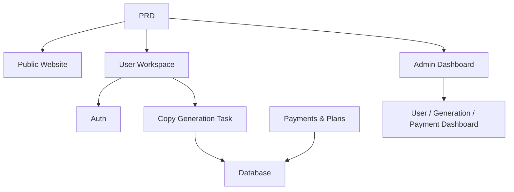

# AI营销文案SaaS

## 概述

本项目要求你为独立开发者和内容团队构建一个基于真正PRD的AI营销文案SaaS产品。你将使用Supabase作为后端服务，Stripe进行支付，实现从需求分析到部署的完整流程。

这是第2阶段的综合实践部分。在前几章中，你已经学习了各个单项技能——前端页面、后端API、数据库和支付集成。本项目将这些技能整合到一个可运行的产品原型中。

## 前置条件

在开始本项目之前，你应该已经熟悉：

- 前端页面设计和组件库（[UI设计](../../frontend/ui-design/)、[现代组件库](../../frontend/modern-component-library/)）
- 后端API设计与开发（[API代码](../../backend/ai-interface-code/)）
- 数据库基础及Supabase使用（[数据库到Supabase](../../backend/database-supabase/)）
- 支付集成（[Stripe支付系统](../../backend/stripe-payment/)）
- Git工作流与部署（[Git & GitHub](../../backend/git-workflow/)、[Web应用部署](../../backend/zeabur-deployment/)）

## 学习目标

完成本项目后，你将能够：

1. 阅读并理解真实PRD，提取开发任务清单
2. 使用AI辅助逐步生成前端页面和后端API
3. 使用Supabase实现用户认证和数据库操作
4. 集成Stripe实现付费订阅功能
5. 构建管理员控制台并完成端到端集成

## 项目概述

你将构建一个AI营销文案SaaS，包含三个子系统：

| 子系统 | 职责 |
|---------|------|
| **公共网站** | 产品介绍、价格、FAQ、注册转化 |
| **用户工作区** | 输入产品信息、生成文案、查看历史记录、升级套餐 |
| **管理员控制台** | 用户管理、生成记录、支付数据、运营概览 |

后端使用Supabase作为数据库和认证服务，Stripe处理支付，AI模型用于生成营销文案。

::: tip PRD
本项目的需求文档在GitHub上：[查看PRD](https://github.com/datawhalechina/easy-vibe/blob/main/docs/en/stage-2/assignments/copywriting-platform-supabase/PRD.md)
:::

<div style="margin: 32px 0;">
  <ClientOnly>
    <StepBar :active="0" :items="[
      { title: '需求', description: '阅读PRD，定义页面、功能、认证和支付范围' },
      { title: '脚手架', description: '使用AI生成三个前端骨架（www / app / admin）' },
      { title: '后端', description: 'Supabase认证、生成API、Stripe支付' },
      { title: '上线', description: '端到端测试、部署并准备演示' }
    ]" />
  </ClientOnly>
</div>

## 第1部分：需求分析

### 1.1 阅读PRD

打开PRD文档并回答以下关键问题：

- 系统有多少个入口？每个入口涵盖哪些页面？
- 每个页面的核心功能是什么？
- 后端包括哪些模块和数据表？
- 套餐定价、支付流程和免费层应如何设计？
- MVP范围是什么？第一版包含什么，哪些不包含？

::: warning
如果上述问题没有明确答案，不要开始编码。需求不明确是最常见的返工原因。
:::

### 1.2 确认系统架构

根据产品需求文档绘制整体架构：



## 第二部分：项目脚手架

### 2.1 生成前端页面

使用 AI 为所有页面生成基本结构和模拟数据。

提示参考：

```text
Based on the current PRD, help me generate a frontend scaffold for an AI marketing copywriting SaaS.

Requirements:
1. Three entry points: www, app, admin
2. www: homepage, pricing, FAQ
3. app: login, register, generation workspace, history, plans page
4. admin: dashboard homepage, user management, generation records, payment orders
5. Only generate page structure with mock data, no real API integration
6. Style should look like a modern SaaS, not a classroom demo
```

### 2.2 改进核心页面

在脚手架准备好之后，重点改进文案生成工作区（仪表板）页面：

```text
Continue refining the /dashboard page.

This is an AI marketing copywriting workspace.

Left side form fields:
- Product name
- One-line description
- Target audience
- 3 selling points
- Distribution channels (website, WeChat Moments, Xiaohongshu, Douyin, email)

Right side result area:
- Main headline
- Subheadline
- CTA
- 3 versions of short copy
- Long-form copy

Use mock data for interactions first.

Requirements:
- Loading state after clicking "Generate Copy"
- Empty state for result area
- Responsive layout, works on both wide and narrow screens
```

### 2.3 验证页面结构

检查每一项：

- [ ] 三个入口路由独立
- [ ] 页面数量与 PRD 匹配
- [ ] 仪表板表单和结果区域布局合理
- [ ] 模拟数据显示基本的 UI 状态

### 遇到困难？

如果在前端搭建过程中遇到困难，请查看这些章节：

- [UI 设计](../../frontend/ui-design/)
- [多产品 UI 设计](../../frontend/multi-product-ui/)
- [LLM 与技能界面美化](../../frontend/llm-skills-beautiful/)
- [设计原型到项目代码](../../frontend/design-to-code/)
- [现代组件库](../../frontend/modern-component-library/)

## 第三部分：后端集成

### 3.1 连接 Supabase 登录

```text
Treat me as a beginner and guide me step by step through Supabase login integration.

Help me complete:
1. Connect the project to Supabase
2. Implement registration, login, and logout
3. Redirect to /dashboard after successful login
4. Redirect unauthenticated users to /login when accessing /dashboard, /billing, /admin
5. Create a profiles table
6. Automatically create a record in profiles table after user registration
7. profiles table includes email, role, and plan fields

Requirements:
- Explain which files are being modified at each step
- Don't hardcode API keys
- Clearly mark any steps that require manual actions in the Supabase dashboard
- Explain how to verify registration and login after completion
```

### 3.2 连接生成 API 与数据库

```text
Treat me as a beginner and help me implement the core feature: generating marketing copy and saving it.

Target behavior:
1. User fills out the form on /dashboard and clicks "Generate Copy"
2. Backend receives: product name, description, target audience, selling points, distribution channels
3. Backend calls the model to generate results
4. Page displays the generated results
5. Both input and output are saved to the database
6. User can view history on next visit

Help me complete:
- Create generation API /api/generate
- Create generations table
- Design input and output fields
- Dashboard page reads current user's history

User experience:
- Button loading state
- Error message on generation failure
- Empty state when no history exists

After completion, explain:
- Frontend page file locations
- Backend API file locations
- Where database write logic lives
- How to test the complete generation pipeline
```

### 3.3 连接 Stripe 支付

```text
Treat me as a beginner and help me add the simplest viable Stripe payment to the project.

No complex system needed — just get the basic payment flow working.

Help me complete:
1. /billing page shows free and pro plans
2. User clicks upgrade → redirects to Stripe Checkout
3. After successful payment, returns to the site
4. Payment result saved to subscriptions table
5. Sync update to profile.plan field
6. Free users limited to 3 generations per day, pro users unlimited

Implementation principles:
- Get the main flow working first, don't worry about complex edge cases
- Clearly document what needs to be configured in Stripe dashboard
- Explain how to test the complete payment flow after completion
```

### 3.4 构建管理员仪表板

```text
Treat me as a beginner and help me build a clean, functional admin dashboard.

Admin-only access.

Help me complete:
1. Only users with role = admin can access /admin
2. Dashboard has 3 tabs: User List, Generation Records, Subscription Status
3. User List shows: email, plan, creation date
4. Generation Records shows: user, product name, channel, creation date
5. Subscription Status shows: user, plan, payment status

Requirements:
- Clean, clear interface
- Use existing component library's table, tab, and badge components
- Explain how to set an account as admin after completion
```

### 卡住了吗？

如果在后端开发过程中遇到困难，请复习以下章节：

- [数据库到 Supabase](../../backend/database-supabase/)
- [带 LLM 辅助的 API 代码](../../backend/ai-interface-code/)
- [Stripe 支付集成](../../backend/stripe-payment/)

## 第 4 部分：集成与发布

### 4.1 端到端测试

至少验证以下场景：

- 注册 → 登录 → 生成副本 → 查看历史 → 升级计划
- 管理员登录 → 查看用户数据 → 查看生成记录 → 查看支付状态

部署前检查：

```text
Treat me as a beginner and help me check if the project is ready for deployment.

Check focus:
- Are environment variables complete?
- Is the login callback URL correct?
- Is the Stripe payment callback URL correct?
- Are there missing loading, empty, or error states on any pages?
- Does the README include setup and deployment instructions?

Help me:
1. List items to fix, prioritized
2. Mark which ones must be fixed first
3. Explain deployment steps after fixes
```

### 4.2 部署

将项目部署到公共环境。关于部署说明，请参见：[Git 和 GitHub 工作流程]（../../backend/git-workflow/）、[Web App 部署]（../../backend/zeabur-deployment/）。

## 交付成果

完成本项目后，请提交以下内容：

- [ ] 可访问的现场演示链接
- [ ] 源代码仓库链接（含 README）
- [ ] PRD文件
- [ ] 核心页面截图（主页、仪表盘、计费、管理员）
- [ ] 60秒演示视频（涵盖注册→生成→付费→管理员）

README 至少应包括：项目概述、核心页面描述、技术栈、本地设置步骤和环境变量列表。

## 评分标准

|尺寸 |基本需求 |高级需求 |
|------------|-------------------|----------------------|
|产品完整性 |首页、登录、仪表盘、计费、管理功能均可访问 |首页文案和视觉风格看起来像真正的SaaS |
|商业循环 |注册 → 登录 → 生成→ 查看历史 作品 端到端 |免费/专业权限差异清晰可见 |
|数据正确性 |生成结果和付款状态保存到数据库 |有清晰的错误信息、空状态和加载状态 |
|认证与安全 |未认证用户无法访问受保护页面;普通用户无法访问管理员 |具备基本输入验证和服务器端认证 |
|工程交付 |项目本地运行并可公开部署 |README 清晰，演示视频结构良好 |

::: 提示
如果任务感觉太大，记住这个原则：**先让它运行，然后再做得漂亮。**
:::

## 提交前检查清单

<el-card shadow=“hover” style=“margin： 20px 0; border-radius： 12px;”>
  <模板 #header>
    <div style=“font-weight： borgan; font-size： 16px;”>提交前的最终检查</div>
  </template>

  <ul style=“list-style-type： none;padding-left： 0;”>
    <li><label><输入类型=“复选框” 禁用 /> 主页、登录、仪表盘、计费和管理员页面均已完成</label></li>
    <li><label><输入类型=“复选框”禁用 /> 用户可以注册、登录和登出</label></li>
    <li><label><输入类型=“复选框”禁用 /> 生成结果实际上会保存到数据库中</label></li>
    <li><label><输入类型=“复选框”禁用 /> 支付主流正常</label></li>
    <li><label><输入类型=“勾选框”禁用 />管理员可以查看用户、生成记录和支付状态</label></li>
    <li><label><输入类型=“复选框”禁用 /> 项目已部署到公共互联网</label></li>
  </ul>
</el-card>

## 参考文献

- [UI设计]（../../frontend/ui-design/）
- [多产品界面设计]（../../frontend/multi-product-ui/）
- [LLM 与技能界面美化]（../../frontend/llm-skills-beautiful/）
- [设计原型到项目代码]（../../前端/设计代码/）
- [现代组件库]（../../frontend/modern-component-library/）
- [数据库至Supabase]（../../backend/database-supabase/）
- [API 代码与 LLM 辅助]（../../backend/ai-interface-code/）
- [Git 和 GitHub 工作流程]（../../backend/git-workflow/）
- [Web 应用部署]（../../后端/zeabur-deployment/）
- [Stripe 支付集成]（../../后端/Stripe-payment/）