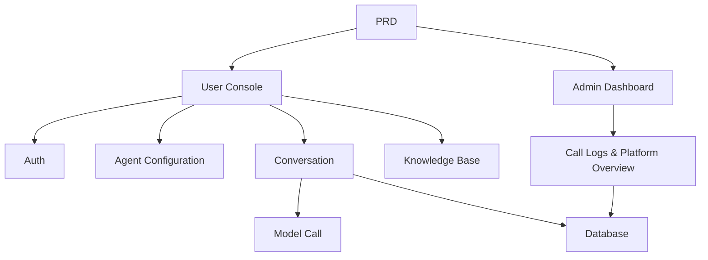

# 定制Dify代理平台

## 概述

该项目要求你构建一个基于真实PRD的代理平台，复制Dify核心体验。你将构建用户控制台、管理仪表盘和平台后端，实现代理管理、对话、日志和知识库等核心功能。

这是第二阶段的全面实践部分。与以往的单页或单功能项目不同，本阶段需要构建一个“平台式”的人工智能产品——具有多角色、多个模块、数据持久性和模型调用流水线。

## 先修条件

在开始这个项目之前，你应该已经熟悉：

- 前端页面设计和组件库（[UI Design]（../../frontend/ui-design/）、[现代组件库]（../../frontend/modern-component-library/））
- 后端API设计与开发（[API代码]（../../后端/AI接口代码/））
- 数据库基础与 Supabase（[数据库到 Supabase]（../../backend/database-supabase/））
- Git 工作流程与部署（[Git & GitHub]（../../backend/git-workflow/）， [Web App 部署]（../../后端/zeabur-deployment/））

## 学习目标

完成该项目后，您将能够：

1. 阅读并理解真实的PRD，提取开发任务清单
2. 设计代理平台的页面架构和数据模型
3. 实现完整的代理创建、对话和日志流水线
4. 利用AI辅助构建平台型产品
5. 完成端到端集成，交付一个可演示的AI平台原型

## 项目概述

你将构建一个类似Dify的代理平台，包含两个子系统：

|子系统 |责任 |
|-----------|---------------|
|**用户控制台** |创建代理，配置提示，发起对话，查看日志，管理知识库 |
|**管理仪表盘** |查看用户数据、平台资源使用、API调用统计 |

后端需要支持：代理管理、会话管理、消息存储、模型调用、通话记录和知识库集成。

::: 提示PRD
该项目的需求文档可在GitHub上：[查看PRD]（https://github.com/datawhalechina/easy-vibe/blob/main/docs/en/stage-2/assignments/custom-dify-agent-platform/PRD.md）
:::

<div style=“margin： 32px 0;”>
  <ClientOnly>
    <StepBar ：active=“0” ：items=“[ { 标题：”需求“，描述：”阅读PRD，定义页面、能力范围、认证和数据模型“}，{ 标题：”Scaffold“，描述：”利用AI生成用户控制台和管理仪表盘骨架“}，{ 标题：”迭代“，描述：”逐模块添加代理、对话、日志和知识库模块“}， {标题：”启动“，描述：”端到端测试、部署并准备演示'} ]“ />
  </ClientOnly>
</div>

## 第一部分：需求分析

### 1.1 阅读PRD

打开PRD文件，回答以下关键问题：

- MVP 中应包含哪些代理、会话、日志和知识库？
- 页面和路线列表最终确定了吗？
- 模型调用与日志记录的边界是什么？
- 是否应该推迟多租户和复杂工作流程？

::: 警告
如果上述问题没有明确答案，就不要开始写代码。需求不明确是最常见的重做原因。
:::

### 1.2 确认系统架构

根据PRD绘制整体架构：



## 第2部分：项目脚手架

### 2.1 生成前端页面

提示参考：

```text
Based on the current PRD, help me generate a frontend scaffold for a Dify-like agent platform.

Requirements:
1. User side: login, agent list, agent configuration, conversation page, logs page, knowledge base page
2. Admin side: dashboard homepage, user overview, resource usage overview
3. Only generate page structure with mock data first, no real API integration
4. Style should look like a modern AI platform
```

### 2.2 验证页面结构

检查每一项：

- [ ] 用户控制台和管理员仪表板入口分开
- [ ] 代理列表、配置、会话、日志和知识库页面完整
- [ ] 管理员仪表板主页和用户概览页面可访问
- [ ] 模拟数据显示基本UI状态

## 第3部分：迭代开发

### 3.1 模块逐步进展

在搭建好的框架上，按以下顺序逐模块添加功能：

1. **认证**：注册、登录、角色区分
2. **代理管理**：创建、编辑、删除、提示配置
3. **会话**：会话创建、消息交换、模型调用
4. **日志**：延迟、令牌使用、错误记录
5. **知识库**（可选）：文档上传、检索、结果注入
6. **管理员仪表板**：用户数据、资源使用、调用统计

每完成一个模块，使用此自检表：

| 检查项 | 验证方法 |
|------------|---------------------|
| 页面一致性 | 页面数量和功能是否与PRD匹配？ |
| API 完整性 | 代理、聊天、日志、知识库API是否完整？ |
| 认证隔离 | 用户是否只能管理自己创建的代理和会话？ |
| 数据一致性 | 消息、日志和文档数据是否一致？ |
| 演示准备度 | 是否可以端到端演示“创建代理 → 聊天 → 查看日志”？ |

### 3.2 知识库集成（可选）

如果希望添加知识库功能，为每个代理添加一个“知识库开关”：

- 启用时：先检索知识片段，然后将其与用户问题一起发送给模型
- 禁用时：以普通对话模式响应

第一版本无需追求复杂的RAG —— 只需确保“检索结果可见且调用链可解释”。

## 第4部分：集成与上线

### 4.1 端到端测试

至少验证以下场景：

- 注册 → 创建代理 → 配置提示 → 开始会话 → 查看日志
- 管理员登录 → 查看用户数据 → 查看调用统计

部署前检查清单：

- [ ] 所有核心API需进行登录验证
- [ ] 代理权限检查通过
- [ ] 会话和日志记录持久化到数据库
- [ ] 模型API密钥使用环境变量，而非硬编码
- [ ] 错误信息在前端可见，而不仅在控制台

### 4.2 部署

将项目部署到公共环境。部署说明见：[Git & GitHub 工作流](../../backend/git-workflow/)、[Web应用部署](../../backend/zeabur-deployment/)。

## 交付物

完成项目后，提交以下内容：

- [ ] 可访问的在线演示链接
- [ ] 源代码仓库链接（含README）
- [ ] PRD文档
- [ ] 核心页面截图（代理管理、会话、日志、管理员仪表板）
- [ ] 60秒演示视频（涵盖创建代理 → 聊天 → 查看日志）

README应至少包含：项目概览、架构描述、技术栈、本地搭建步骤、环境变量列表及API文档。

## 评分标准

| 维度 | 基本要求 | 高级要求 |
|------------|-------------------|----------------------|
| 平台完整性 | 代理/聊天/日志页面可用 | 具有清晰的导航和统一的设计语言 |
| 业务流程 | 可以创建代理并进行真实对话 | 支持多代理切换和会话历史 |
| 数据与追踪 | 消息和通话日志可查询 | 具有 词元 / 延迟统计仪表盘 |
| 认证与安全 | 仅登录用户可以访问核心 API | 资源所有权验证 robust |
| 工程交付 | 可部署、可演示、README 清晰 | 知识库集成可解释的检索 |

## 提交前检查清单

<el-card shadow="hover" style="margin: 20px 0; border-radius: 12px;">
  <template #header>
    <div style="font-weight: bold; font-size: 16px;">提交前最终检查</div>
  </template>

  <ul style="list-style-type: none; padding-left: 0;">
    <li><label><input type="checkbox" disabled /> 登录后可访问代理管理、会话和日志页面</label></li>
    <li><label><input type="checkbox" disabled /> 至少可以创建 1 个代理并成功进行对话</label></li>
    <li><label><input type="checkbox" disabled /> 每轮问答可在数据库中找到</label></li>
    <li><label><input type="checkbox" disabled /> 调用失败会在前端显示错误信息并记录日志</label></li>
    <li><label><input type="checkbox" disabled /> 项目已部署，README 和演示视频完整</label></li>
  </ul>
</el-card>

## 参考资料

- [UI 设计](../../frontend/ui-design/)
- [现代组件库](../../frontend/modern-component-library/)
- [数据库迁移到 Supabase](../../backend/database-supabase/)
- [带 LLM 辅助的 API 代码](../../backend/ai-interface-code/)
- [Git & GitHub 工作流](../../backend/git-workflow/)
- [Web 应用部署](../../backend/zeabur-deployment/)