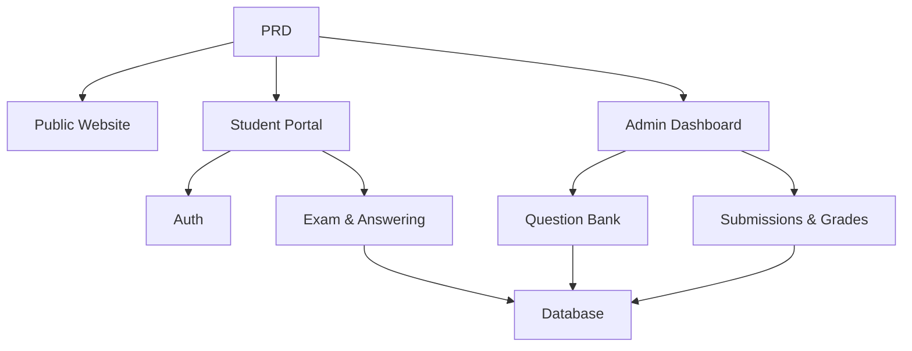

# 在线考试与管理系统

## 概述

该项目要求你从零构建一个在线考试与管理系统，基于真实的产品需求文档（PRD）。这个项目的特别之处在于其多角色设计——学生和管理员看到不同的页面并执行不同的操作。你将使用 Express 构建后端，实现完整的考试业务流程。

这是第二阶段的综合实践部分。多角色权限系统在真实应用中非常常见。一旦掌握此模式，你将能够处理各种教育、SaaS 和管理后台场景。

## 前提条件

在开始本项目之前，你应已经熟悉：

- 前端页面设计和组件库 ([UI 设计](../../frontend/ui-design/), [现代组件库](../../frontend/modern-component-library/))
- 后端 API 设计与开发 ([API 代码](../../backend/ai-interface-code/))
- 数据库基础与 Supabase ([数据库到 Supabase](../../backend/database-supabase/))
- Git 工作流程及部署 ([Git & GitHub](../../backend/git-workflow/), [Web 应用部署](../../backend/zeabur-deployment/))

## 学习目标

完成本项目后，你将能够：

1. 阅读并理解真实 PRD，提取开发任务清单
2. 设计多角色系统的权限控制和页面路由
3. 使用 Express 构建完整的后端 API
4. 实现考试、提交及自动评分业务流程
5. 完成端到端集成并交付可演示的系统原型

## 项目概览

你将构建一个包含三个子系统的在线考试与管理系统：

| 子系统 | 职责 |
|--------|------|
| **公共网站** | 平台介绍：首页登录入口 |
| **学生门户** | 考试列表、参加考试、提交、查看成绩 |
| **管理员后台** | 题库管理、考试管理、提交记录管理、成绩统计 |

后端使用 Express，并需要支持：登录验证、角色权限、考试和题库管理、提交流程与自动评分、成绩/统计管理。

::: tip PRD
本项目的需求文档在 GitHub 上：[查看 PRD](https://github.com/datawhalechina/easy-vibe/blob/main/docs/en/stage-2/assignments/exam-management-express/PRD.md)
:::

<div style="margin: 32px 0;">
  <ClientOnly>
    <StepBar :active="0" :items="[
      { title: '需求', description: '阅读 PRD，定义角色、页面、考试流程和数据模型' },
      { title: '脚手架', description: '使用 AI 生成学生和管理员页面骨架' },
      { title: '后端', description: '连接登录、考试、提交和评分功能，并使用 Express 实现' },
      { title: '上线', description: '端到端测试，部署并准备演示' }
    ]" />
  </ClientOnly>
</div>

## 第 1 部分：需求分析

### 1.1 阅读 PRD

打开 PRD 文档并回答以下关键问题：

- 系统有多少角色？每个角色能做什么？
- 页面列表是否完整？学生门户和管理员后台各有什么页面？
- 支持哪些题型？每种题型的评分逻辑如何？
- 完整的考试流程是怎样的？（发布 → 开始 → 答题 → 提交 → 评分 → 查看结果）

::: warning
如果上述问题没有清晰答案，不要开始编码。不明确的需求是返工最常见的原因。
:::

### 1.2 确认系统架构

根据产品需求文档绘制整体架构：



## 第2部分：项目脚手架

### 2.1 生成前端页面

提示参考：

```text
Based on the current PRD, help me generate a frontend scaffold for an online exam and management system.

Tech stack:
- Next.js App Router
- TypeScript
- Tailwind CSS
- shadcn/ui

Page list:
1. Homepage /
2. Login page /login
3. Student exam list /student/exams
4. Student exam taking /student/exams/[id]
5. Student grades /student/history
6. Admin dashboard /admin
7. Exam management /admin/exams
8. Question bank /admin/questions
9. Submission records /admin/submissions

Requirements:
- Student pages should be clean, focused, and easy to answer questions on
- Admin pages should use sidebar + top bar layout
- Use mock data first, no real API integration
- Ensure basic usability on both desktop and mobile
```

### 2.2 优化学生考试页面

考试页面是学生门户的核心。重点优化它：

```text
Continue refining the student exam-taking page.

This is an exam-taking page for an online exam system, it should include:
- Top bar: exam title, countdown timer, number of answered questions
- Main area: question stem and options
- Support three question types: single choice, true/false, short answer
- Answer card on the left or top showing which questions have been answered
- Confirmation dialog before submission

Use mock data for interactions first, no real API.

Requirements:
- Clean interface, shouldn't look like a backend table page
- Countdown should be prominent but not overly stressful
- Include empty states and loading states
```

### 2.3 优化管理员仪表板

管理员仪表板的第一个版本侧重于三个核心领域：

- **考试管理**：创建考试、设置时长、管理发布状态
- **题库**：添加题目、编辑题目、按类型筛选
- **提交记录**：查看学生提交、成绩、时间戳

### 2.4 验证页面结构

检查每一项：

- [ ] 学生和管理员入口分开
- [ ] 登录、考试列表、考试进行中及成绩页面完整
- [ ] 管理员题库、考试管理和提交记录页面可访问
- [ ] 学生和管理员页面样式明显区分

### 遇到困难？

如果在前端脚手架搭建过程中遇到困难，请参考以下章节：

- [从数据库到 Supabase](../../backend/database-supabase/)
- [后端 API 设计与开发](../../backend/ai-interface-code/)
- [现代组件库](../../frontend/modern-component-library/)

## 第 3 部分：后端开发

### 3.1 登录与权限控制

```text
Treat me as a beginner and help me implement login and permission control for the online exam system.

Backend: Express.

Goals:
1. Both students and admins can log in
2. Login returns the user's role
3. Students can only access /student/* APIs
4. Admins can only access /admin/* APIs
5. Unauthenticated users accessing protected pages redirect to /login

Requirements:
- Suggest a clear directory structure
- Explain what the middleware is responsible for
- Don't hardcode environment variables
- Explain how to verify permissions work after implementation
```

### 3.2 考试与题库 API

按模块推荐的实现方案：

| 模块 | 建议的 API |
|--------|---------------|
| 考试管理 | `GET /api/exams`, `POST /api/admin/exams`, `PATCH /api/admin/exams/:id` |
| 题库 | `GET /api/admin/questions`, `POST /api/admin/questions` |
| 开始考试 | `POST /api/submissions/start` |
| 提交考试 | `POST /api/submissions/:id/submit` |
| 成绩记录 | `GET /api/student/history`, `GET /api/admin/submissions` |

提示参考：

```text
Help me design and implement Express APIs for the online exam system.

Scope:
- Admin creates exams
- Admin manages question bank
- Students view published exams
- Students start exam and create submission
- Student submissions auto-grade multiple choice and true/false
- Short answer questions marked as pending review
- Students view their grade history
- Admins view all submission records

Requirements:
- Clear API naming
- Unified JSON response structure
- Separate code into controller, service, middleware, and db layers
- Explain how to test each API
```

### 3.3 评分逻辑

评分逻辑是考试系统的核心业务规则：

- **选择题**：如果用户的答案与正确答案相符，则得分
- **真/假**：也可以自动评分
- **简短回答**：第一版只保存答案，分数为空，状态为 `reviewed = false`

::: 小费 额外
如果你想增加AI功能，可以让管理员输入“主题难度”，让模型生成候选题供人工审核，然后再加进数据库。但这只是额外内容，不是必须的。
:::

## 第四部分：整合与启动

### 4.1 端到端测试

至少，请核实以下情景：

- 学生登录 → 查看考试列表 → 开始考试 → 提交 → 查看成绩
- 管理员登录 → 创建考试 → 添加问题 → 发布 → 查看提交记录

### 4.2 部署

- 前端：部署到 Vercel / Zeabur
- Express API：部署到 Zeabur / Railway / Render
- 数据库：使用 Supabase Postgres 或托管的 PostgreSQL

部署前检查清单：

- [ ] 环境变量已完成
- [ ] 前端和后端 API URL 是正确的
- [ ] 登录状态在生产环境中工作
- [ ] 管理员账户实际上可以访问仪表盘
- [ ] README 包含设置、部署和测试说明

## 交付成果

完成本项目后，请提交以下内容：

- [ ] 可访问的现场演示链接
- [ ] 源代码仓库链接（含 README）
- [ ] PRD文件
- [ ] 核心页面截图（主页、学生考试列表、考试页面、管理仪表盘）
- [ ] 60秒演示视频（涵盖学生考试流程和管理流程）

README 至少应包括：项目概述、核心页面描述、技术栈、本地设置步骤和环境变量列表。

## 评分标准

|尺寸 |基本需求 |高级需求 |
|------------|-------------------|----------------------|
|页面完整性 |学生和管理主页均可访问 |统一页面样式，基本移动响应 |
|商业循环 |学生可以登录、参加考试、提交和查看成绩 |管理员可以完整创建和发布考试 |
|数据正确性 |提交的答案会保存到数据库，客观问题自动评分 |简答题支持手动复习或AI辅助 |
|权限控制 |学生和管理员的访问界限清晰 |服务器端 API 也支持角色验证 |
|工程交付 |项目运行且可部署，README 清晰 |有演示视频和测试说明 |

## 提交前检查清单

<el-card shadow=“hover” style=“margin： 20px 0; border-radius： 12px;”>
  <模板 #header>
    <div style=“font-weight： borgan; font-size： 16px;”>提交前的最终检查</div>
  </template>

  <ul style=“list-style-type： none;padding-left： 0;”>
    <li><label><输入类型=“勾选框”已禁用 /> 主页、登录、学生门户和管理仪表盘页面已完成</label></li>
    <li><label><输入类型=“勾选框”禁用 /> 学生可以正常开始考试并提交答案</label></li>
    <li><label><输入类型=“复选框” 已禁用 /> 管理员可以创建考试并查看提交记录</label></li>
    <li><label><输入类型=“勾选框”禁用 /> 客观题目分数自动计算并保存到数据库</label></li>
    <li><label><输入类型=“复选框”禁用 /> 学生和管理员权限边界已验证</label></li>
    <li><label>启用 <input type=“checkbox” /> 项目已部署或拥有完整的本地设置说明</label></li>
  </ul>
</el-card>

## 参考资料

- [UI设计](../../frontend/ui-design/)
- [现代组件库](../../frontend/modern-component-library/)
- [数据库到Supabase](../../backend/database-supabase/)
- [在LLM辅助下编写API代码](../../backend/ai-interface-code/)
- [Git与GitHub工作流程](../../backend/git-workflow/)
- [Web应用部署](../../backend/zeabur-deployment/)