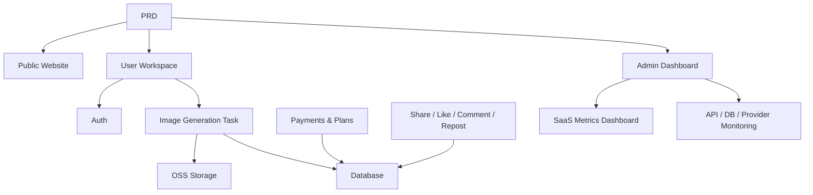

# 现代人工智能图像生成SaaS

## 概述

该项目要求你从零开始基于真实PRD构建一款受Midjourney启发的AI图像生成SaaS产品。你将经历完整的流程：需求分析、项目拆解、迭代开发和集成测试。

这是第二阶段的全面实践部分。在之前的章节中，你已经学习了个人技能——前端设计、后端API、数据库、支付集成。本项目将所有这些技能整合成一个可运行的产品原型。

## 先修条件

在开始这个项目之前，你应该已经熟悉：

- 前端页面设计和组件库（[UI Design]（../../frontend/ui-design/）、[现代组件库]（../../frontend/modern-component-library/））
- 后端API设计与开发（[API代码]（../../后端/AI接口代码/））
- 数据库基础与 Supabase（[数据库到 Supabase]（../../backend/database-supabase/））
- 支付集成（[Stripe 支付系统]（../../后端/Stripe-payment/））
- Git 工作流程与部署（[Git & GitHub]（../../backend/git-workflow/）， [Web App 部署]（../../后端/zeabur-deployment/））

## 学习目标

完成该项目后，您将能够：

1. 阅读并理解真实的PRD，提取开发任务清单
2. 根据PRD拆解模块，制定逐步计划
3. 利用AI辅助构建前端支架和后端API
4. 对每个模块进行验证和迭代
5. 完成端到端集成，将项目从“本地运行”转变为“可交付”

## 项目概述

你将构建一个现代化的AI图像生成SaaS平台，包含三个子系统：

|子系统 |责任 |
|-----------|---------------|
|**公共网站** |产品介绍、定价、常见问题解答、注册转换 |
|**用户工作区** |提示输入、图片生成、画廊、制作人员、计划、社区互动 |
|**管理仪表盘** |用户管理、任务管理、支付管理、内容审核、SaaS指标、系统监控 |

后端需要支持：用户认证、图像生成任务、开源软件对象存储、信用和计划支付、图像社交互动以及运营数据监控。

::: 提示PRD
该项目的需求文档可在 GitHub 上：[查看 PRD]（https://github.com/datawhalechina/easy-vibe/blob/main/docs/en/stage-2/assignments/modern-landing-page/PRD.md）
:::

<div style=“margin： 32px 0;”>
  <ClientOnly>
    <StepBar ：active=“0” ：items=“[ { 标题：”需求“，描述：”阅读PRD，提取页面、模块、数据模型和范围“}，{ 标题：”Scaffold“，描述：”用AI生成三个前端骨架（www / app / admin）“，{ 标题：”迭代“，描述：”添加API、认证、支付、逐模块监控“}， {标题：”启动“，描述：”端到端测试、部署和准备演示“} ]” />
  </ClientOnly>
</div>

## 第一部分：需求分析

### 1.1 阅读PRD

打开PRD文件，回答以下关键问题：

- 系统有多少个入口？每个入口覆盖哪些页面？
- 每个页面的核心功能是什么？
- 后端包含哪些模块和数据库表？
- MVP范围是什么？第一版里放什么，不放什么？

::: 警告
如果上述问题没有明确答案，就不要开始写代码。需求不明确是最常见的重做原因。
:::

### 1.2 确认系统架构

根据产品需求文档绘制整体架构：



我们建议用你自己的语言绘制架构图，以确认你对其理解是完整的。

## 第二部分：项目脚手架

### 2.1 生成前端页面

使用 AI 为所有页面生成基本结构和模拟数据。这里的目标是建立信息架构和路由——暂时不进行真实的 API 集成。

提示参考：

```text
Based on the current PRD, help me generate a frontend scaffold for a modern AI image generation SaaS.

Requirements:
1. Three entry points: www, app, admin
2. www: homepage, pricing, FAQ
3. app: login, register, generation workspace, gallery, plans, credits, community, artwork detail, profile
4. admin: dashboard homepage, user management, task management, content management, plan management, payment orders, operations config, SaaS metrics, system monitoring
5. Only generate page structure with mock data, no real API integration
6. Style reference: Midjourney — clean, modern, product-like
```

### 2.2 验证页面结构

生成脚手架后，检查每一项：

- [ ] 三个入口路由是独立的 (`/`, `/app`, `/admin`)
- [ ] 页面数量与 PRD 一致
- [ ] 每个页面可以访问和导航
- [ ] 模拟数据显示基本 UI 状态（列表、空状态、表单等）

## 第三部分：迭代开发

### 3.1 模块逐步推进

在脚手架的基础上，按以下顺序逐模块添加功能：

1. **认证**：注册、登录、角色区分
2. **数据库**：表创建、读写 API
3. **核心业务**：图像生成任务、结果存储
4. **OSS 存储**：图像上传与访问
5. **支付**：套餐、积分、Stripe 集成
6. **社交互动**：分享、点赞、评论
7. **管理面板**：用户管理、任务管理、内容审核
8. **数据监控**：SaaS 指标面板、系统监控

每个模块完成后，使用以下自检表：

| 检查项 | 验证方法 |
|--------|------------|
| 页面一致性 | 页面数量、入口点和功能是否符合 PRD？ |
| API 正确性 | 请求参数、响应结构和状态处理是否合理？ |
| 认证隔离 | 普通用户与管理员是否正确区分？ |
| 数据一致性 | 数据库、OSS、支付和积分数据是否一致？ |
| 演示就绪 | 是否可以向他人演示完整业务流程？ |

::: tip
如果 AI 生成内容与 PRD 偏离，不要丢弃整个页面——只需让它修复具体模块。
:::

### 3.2 角色与职责

在迭代过程中，你需要同时扮演三个角色：

- **产品经理**：确认每个模块的功能符合 PRD
- **技术负责人**：确认实现方案合理
- **QA 工程师**：确认功能实际可用

## 第四部分：集成与发布

### 4.1 端到端测试

此阶段重点不是新增页面，而是运行完整业务流程。至少需验证：

- 注册 → 购买积分 → 生成图像 → 查看历史 → 分享和互动
- 管理员登录 → 查看用户数据 → 查看任务统计 → 查看系统监控

### 4.2 部署

将项目部署到公共环境，确保：

- 环境变量已完全配置
- 登录回调 URL 正确
- 支付回调 URL 正确
- 页面没有缺失加载、空状态或错误提示

部署说明请参见：[Git & GitHub 工作流](../../backend/git-workflow/)、[Web 应用部署](../../backend/zeabur-deployment/)。

## 交付物

完成项目后，提交以下内容：

- [ ] 可访问的演示链接
- [ ] 源代码仓库链接（含 README）
- [ ] PRD 文档
- [ ] 核心页面截图（首页、生成工作区、画廊、套餐页、管理面板）
- [ ] 60 秒演示视频（覆盖注册 → 生成 → 查看 → 管理员管理）

README 至少应包含：项目概览、核心页面描述、技术栈、本地设置步骤和环境变量列表。

## 评分标准

| 维度 | 基本要求 | 高级要求 |
|------------|-------------------|----------------------|
| PRD 对齐 | 页面、功能和数据结构基本符合 PRD | 能清晰说明每个设计决策对应的 PRD |
| 产品流程 | 注册 → 购买积分 → 生成图片 → 查看历史 → 分享作品 全流程 | 支付状态、积分余额和生成次数数据保持一致 |
| 管理功能 | 可查看用户、任务、支付和内容管理 | SaaS 指标仪表盘和系统监控页面功能完善 |
| 工程完整性 | 前端、后端、数据库、开源软件、支付流程已连接 | 具备错误处理、空状态和加载状态 |
| 交付质量 | 可部署并运行 | README 清晰，演示视频结构合理 |

## 参考资料

- [UI 设计](../../frontend/ui-design/)
- [多产品 UI 设计](../../frontend/multi-product-ui/)
- [LLM & 技能界面美化](../../frontend/llm-skills-beautiful/)
- [设计原型到项目代码](../../frontend/design-to-code/)
- [现代组件库](../../frontend/modern-component-library/)
- [数据库到 Supabase](../../backend/database-supabase/)
- [在 LLM 协助下编写 API 代码](../../backend/ai-interface-code/)
- [Git & GitHub 工作流](../../backend/git-workflow/)
- [Web 应用部署](../../backend/zeabur-deployment/)
- [Stripe 支付集成](../../backend/stripe-payment/)