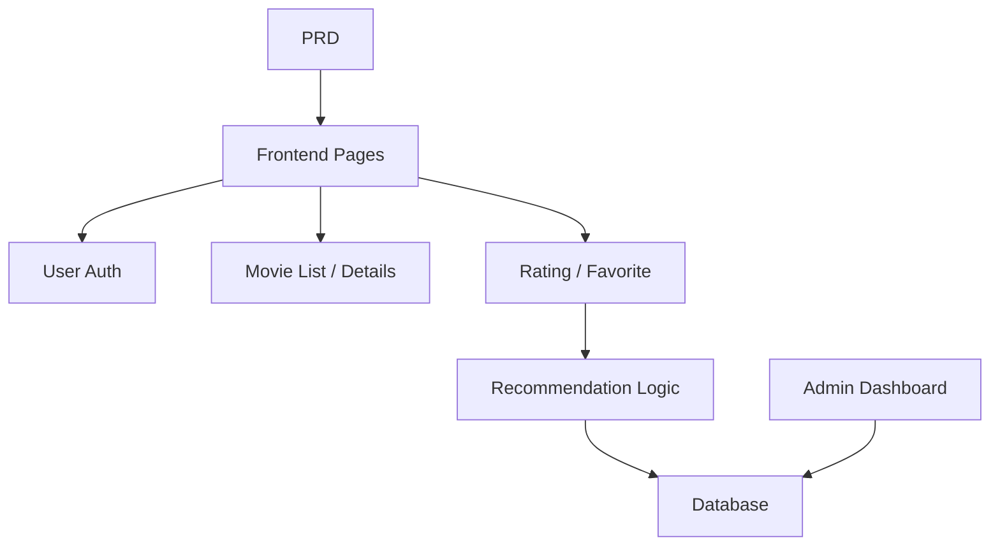

# 春季靴电影推荐系统

## 概述

该项目要求你基于真实PRD构建一个带有推荐功能的Spring Boot电影网站。核心挑战不是简单的CRUD——而是思考“用户行为如何影响推荐”以及“如何让推荐可解释”。

这是第二阶段的综合实践部分。你将首次接触到“内容行为推荐”产品开发模式，这在电商、内容平台和个性化推送中很常见。

## 先修条件

在开始这个项目之前，你应该已经熟悉：

- 前端页面设计和组件库（[UI Design]（../../frontend/ui-design/）、[现代组件库]（../../frontend/modern-component-library/））
- 后端API设计与开发（[API代码]（../../后端/AI接口代码/））
- 数据库基础与 Supabase（[数据库到 Supabase]（../../backend/database-supabase/））
- Git 工作流程与部署（[Git & GitHub]（../../backend/git-workflow/）， [Web App 部署]（../../后端/zeabur-deployment/））

## 学习目标

完成该项目后，您将能够：

1. 阅读PRD并提取推荐系统开发任务列表
2. 建立一个 Spring Boot 项目并实现 RESTful API
3. 根据“用户行为→推荐”设计完整的数据流水线
4. 实现可解释的推荐逻辑
5. 完成端到端集成，交付可演示的产品原型

## 项目概述

你将建立一个带有推荐功能的电影网站：

|特色 |描述 |
|---------|-------------|
|**浏览与搜索** |用户可以浏览和搜索电影 |
|**评分与收藏** |用户可以评分和收藏电影 |
|**个性化推荐** |系统根据用户行为生成推荐 |
|**管理仪表盘** |管理员管理电影数据并查看推荐表现 |

::: 提示PRD
该项目的需求文档可在 GitHub 上：[查看 PRD]（https://github.com/datawhalechina/easy-vibe/blob/main/docs/en/stage-2/assignments/movie-recommendation-springboot/PRD.md）
:::

<div style=“margin： 32px 0;”>
  <ClientOnly>
    <StepBar ：active=“0” ：items=“[ { 标题：”需求“，描述：”阅读PRD，定义推荐策略、行为数据和管理范围“}，{ 标题：”支架“，描述：”使用AI生成列表、细节、推荐和管理页面“}，{标题：”迭代“，描述：”添加推荐逻辑、行为跟踪和管理“}，{标题：”启动“，描述：”端到端测试、部署并准备演示“} ]” />
  </ClientOnly>
</div>

## 第一部分：需求分析

### 1.1 阅读PRD

打开PRD文件，回答以下关键问题：

- 推荐策略是什么？第一个版本是否应采用可解释的方法（例如基于评分的相似性）？
- 应存储哪些用户行为数据？（评分、收藏、浏览历史等）
- 管理员应查看哪些推荐绩效指标？
- 页面列表完整了吗？

::: 警告
如果上述问题没有明确答案，就不要开始写代码。需求不明确是最常见的重做原因。
:::

### 1.2 确认系统架构



## 第2部分：项目脚手架

### 2.1 生成前端页面

提示参考：

```text
Based on the current PRD, help me generate a frontend scaffold for a Spring Boot movie recommendation system.

Requirements:
1. Pages: homepage, movie list, movie detail, recommendation page, user profile, admin dashboard
2. Only generate page structure with mock data first, no real API integration
3. Style should look like a real content product, not a classroom demo
```

### 2.2 验证页面结构

检查每一项：

- [ ] 电影列表页面支持搜索和筛选
- [ ] 电影详情页包含评分和最爱按钮
- [ ] 推荐页面显示结果及推荐理由
- [ ] 管理仪表盘显示电影数据和推荐表现

## 第三部分：迭代开发

### 3.1 模块逐模块进展

1. **Spring Boot 设置**：项目结构、数据库配置、基础 CRUD
2. **电影数据管理**：电影列表、详细信息、搜索API
3. **用户行为**：评分、收藏API、行为数据存储
4. **推荐逻辑**：基于用户行为实现推荐算法
5. **推荐显示**：展示推荐结果并附有说明
6. **管理仪表盘**：电影数据管理，推荐绩效评估

### 3.2 模块自我检查

|检查项目 |验证方法 |
|------------|---------------------|
|基本功能 |列表、详情、评分、收藏是封闭循环吗？|
|推荐链接 |用户行为会影响推荐结果吗？|
|可解释性 |用户能理解为什么这些电影会被推荐吗？|
|管理员数据 |管理员可以查看电影数据和推荐表现吗？|

## 第四部分：整合与启动

### 4.1 端到端测试

至少，请核实以下情景：

- 浏览电影 → 评分 → 最爱 → 查看推荐页面，确认结果变化
- 管理员登录 → 添加电影 → 查看推荐性能统计

## 交付成果

完成本项目后，请提交以下内容：

- [ ] 可访问的现场演示链接
- [ ] 源代码仓库链接（含 README）
- [ ] PRD文件
- [ ] 核心页面截图（电影列表、电影详情、推荐页面、管理仪表盘）
- [ ] 60秒演示视频

## 评分标准

|尺寸 |基本需求 |高级需求 |
|------------|-------------------|----------------------|
|PRD 对齐 |页面、功能和数据结构基本符合 PRD |能清晰解释设计决策 |
|产品循环 |浏览 → 评分 → 最爱 → 推荐作品 端到端 |评分行为明显影响推荐 |
|推荐质量 |结果合理，理由可解释 |支持多种推荐策略 |
|管理能力 |可查看电影数据和推荐表现 |拥有推荐准确度等统计数据 |
|工程完整性 |前端，Spring Boot 后端，数据库流水线连接 |推荐 API 支持缓存或性能优化 |

## 参考文献

- [UI设计]（../../frontend/ui-design/）
- [现代组件库]（../../frontend/modern-component-library/）
- [数据库至Supabase]（../../backend/database-supabase/）
- [API 代码与 LLM 辅助]（../../backend/ai-interface-code/）
- [Git 和 GitHub 工作流程]（../../backend/git-workflow/）
- [Web 应用部署]（../../后端/zeabur-deployment/）