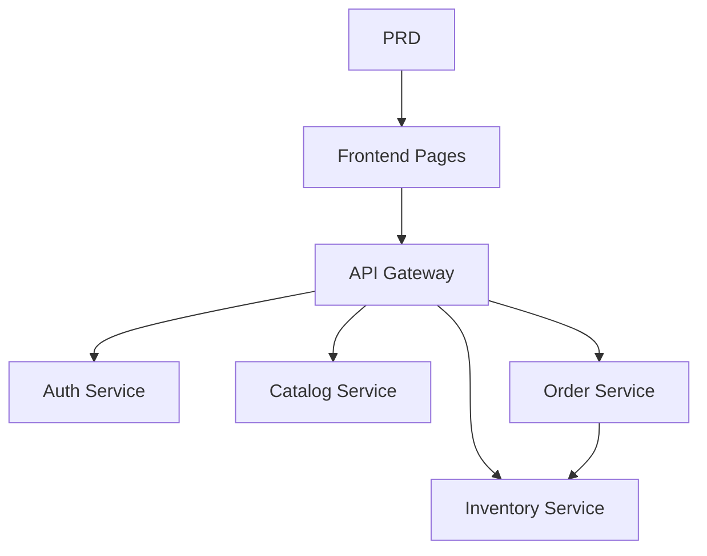

# 杂货电子商务微服务系统

## 概述

该项目要求你从零开始构建基于真实PRD的杂货电商微服务系统。与以往的单一服务项目不同，这里的后台按业务领域划分为多个独立服务，并通过API网关进行统一。你将学习如何设计服务边界并处理跨服务数据一致性。

这是第二阶段的综合实践部分。微服务架构在实际应用中非常常见。一旦你掌握了服务分解和网关路由，你就能处理更复杂的后端系统设计。

## 先修条件

在开始这个项目之前，你应该已经熟悉：

- 前端页面设计和组件库（[UI Design]（../../frontend/ui-design/）、[现代组件库]（../../frontend/modern-component-library/））
- 后端API设计与开发（[API代码]（../../后端/AI接口代码/））
- 数据库基础与 Supabase（[数据库到 Supabase]（../../backend/database-supabase/））
- Git 工作流程与部署（[Git & GitHub]（../../backend/git-workflow/）， [Web App 部署]（../../后端/zeabur-deployment/））

## 学习目标

完成该项目后，您将能够：

1. 读取PRD并提取微服务系统的开发任务列表
2. 按业务域（授权、目录、库存、订单）分解服务边界
3. 设计和实现API网关路由
4. 处理跨服务问题，如库存扣除和订单一致性
5. 完成端到端集成，交付可演示的微服务原型

## 项目概述

你将构建一个杂货电子商务微服务系统：

|子系统 |责任 |
|-----------|---------------|
|**用户前端** |浏览产品，下单，查看订单历史 |
|**管理门户** |产品管理，库存管理，订单管理 |

后端分为以下服务：

|服务 |责任 |
|---------|---------------|
|**API 网关** |统一入口点、路由转发、身份验证 |
|**认证服务** |用户注册、登录、JWT发布 |
|**目录服务**产品信息管理 |
|**库存服务**库存数量管理 |
|**订单服务**订单创建，状态管理 |

::: 提示PRD
该项目的需求文档在GitHub上：[查看PRD]（https://github.com/datawhalechina/easy-vibe/blob/main/docs/en/stage-2/assignments/simple-grocery-microservices/PRD.md）
:::

<div style=“margin： 32px 0;”>
  <ClientOnly>
    <StepBar ：active=“0” ：items=“[ { 标题：”需求“，描述：”读取PRD，定义服务分解、页面和事务流程“}， {标题：”支架“，描述：”生成前端、网关和服务骨架“}， {标题：”迭代“，描述：”逐模块添加API，修正库存和订单一致性“}， {标题：”启动“，描述：”端到端测试、部署并准备演示“} ]” />
  </ClientOnly>
</div>

## 第一部分：需求分析

### 1.1 阅读PRD

打开PRD文件，回答以下关键问题：

- 服务应如何拆分？每个服务的职责边界是什么？
- 用户前端和管理门户各需要哪些页面？
- 下单后库存扣减策略是什么？如何处理成功/失败/超时？
- 哪些复杂功能（分布式事务、消息队列）应在首个版本中跳过？

::: warning
如果上述问题没有明确答案，请不要开始编码。不清晰的需求是返工的最常见原因。
:::

### 1.2 确认系统架构



## 第2部分：项目脚手架

### 2.1 生成项目结构

提示参考：

```text
Based on the current PRD, help me generate a project scaffold for a grocery e-commerce microservices system.

Requirements:
1. Generate user frontend and admin portal skeletons
2. Generate five directories: api-gateway, auth-service, catalog-service, inventory-service, order-service
3. Each service should only have a minimal runnable entry point
4. Don't connect to a real database or payment system yet
```

### 2.2 验证项目结构

检查每一项：

- [ ] 五个服务目录结构清晰
- [ ] API Gateway 启动并转发请求
- [ ] 每个服务的健康检查端点都正常工作
- [ ] 用户前端和管理员门户页面均可访问

## 第三部分：迭代开发

### 3.1 模块逐模块进展

1. **API 网关**：路由配置，JWT 验证中间件
2. **认证服务**：注册、登录、JWT签发
3. **目录服务**：产品CRUD，列表查询
4. **库存服务**：库存查询，库存扣款
5. **订单服务**：订单创建、状态切换、库存整合
6. **管理门户**：产品管理、库存管理、订单管理

### 3.2 模块自我检查

|检查项目 |验证方法 |
|------------|---------------------|
|网关路由 |服务API是否正确通过网关转发？ |
|认证隔离 |用户和管理员API是否被正确分开？ |
|数据一致性 |产品和库存数据是否同步？ |
|交易循环 |下单后，库存扣除和订单状态是否一致？ |
|故障处理 |库存不足或超时是否有补偿机制？ |

## 第四部分：整合与启动

### 4.1 端到端测试

至少，请核实以下情景：

- 浏览产品 → 加入购物车 → 下单 → 查看订单
- 管理员 → 添加产品 → 更新库存 → 查看订单

## 交付成果

完成本项目后，请提交以下内容：

- [ ] 可访问的现场演示链接
- [ ] 源代码仓库链接（含 README）
- [ ] PRD文件
- [ ] 核心页面截图（产品列表、订单页面、订单历史、管理仪表盘）
- [ ] 60秒演示视频

## 评分标准

|尺寸 |基本需求 |高级需求 |
|------------|-------------------|----------------------|
|PRD 对齐 |页面、功能和服务分解基本符合 PRD |能清晰解释服务分解的理由 |
|产品循环 |浏览 → 订单 → 库存扣除 → 查看订单全流程 |订单超时或库存不足有补偿机制 |
|服务架构 |每个服务独立启动，通过网关访问 |服务间通信具有错误处理和重试 |
|管理能力 |产品、库存和订单管理功能正常 |管理门户提供数据统计 |
|工程完整性 |前端、网关、服务、数据库流水线连接 |支持 Docker Compose 或类似的编排 |

## 参考文献

- [UI设计]（../../frontend/ui-design/）
- [现代组件库]（../../frontend/modern-component-library/）
- [数据库至Supabase]（../../backend/database-supabase/）
- [API 代码与 LLM 辅助]（../../backend/ai-interface-code/）
- [Git 和 GitHub 工作流程]（../../backend/git-workflow/）
- [Web 应用部署]（../../后端/zeabur-deployment/）