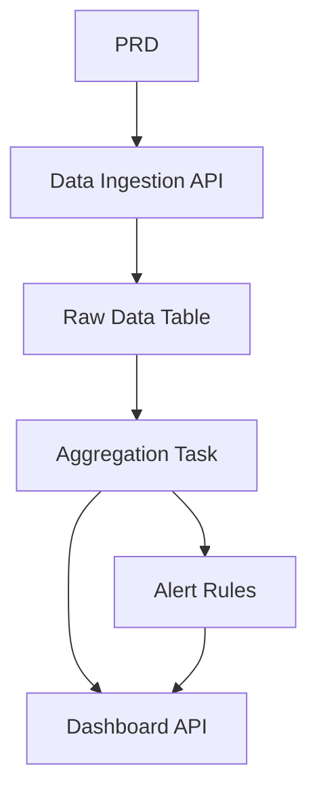

# Go 交通数据分析平台

## 概述

该项目要求你基于真实PRD构建一个使用Go的交通数据分析平台。与之前的CRUD系统不同，你将构建完整的数据流水线：“数据摄取→聚合→警报→可视化。”这类数据产品在物联网、监控和运营分析中非常常见。

这是第二阶段的全面实践部分，也是你首次接触Go。别担心——凭借你的JavaScript/TypeScript背景，学习Go并不难。重点是理解数据流水线设计原则。

## 先修条件

在开始这个项目之前，你应该已经熟悉：

- 前端页面设计和组件库（[UI Design]（../../frontend/ui-design/）、[现代组件库]（../../frontend/modern-component-library/））
- 后端API设计与开发（[API代码]（../../后端/AI接口代码/））
- 数据库基础与 Supabase（[数据库到 Supabase]（../../backend/database-supabase/））
- Git 工作流程与部署（[Git & GitHub]（../../backend/git-workflow/）， [Web App 部署]（../../后端/zeabur-deployment/））

## 学习目标

完成该项目后，您将能够：

1. 读取PRD并提取数据产品的开发任务列表
2. 使用Go（Gin或Fiber）构建后端API服务
3. 设计完整的数据摄取、窗口聚合和警报流水线
4. 保持后端数据和前端仪表盘的一致性
5. 完成端到端集成，交付可演示的数据产品原型

## 项目概述

你将构建一个 Go 流量数据分析平台：

|模块 |责任 |
|--------|---------------|
|**数据摄取** |接收原始流量事件并存储 |
|**数据聚合** |按时间窗口计算趋势和拥堵指标 |
|**警报** |根据规则生成警报记录 |
|**仪表盘** |前端显示趋势图表、排名和警报列表 |

::: 提示PRD
该项目的需求文档可在GitHub上：[查看PRD]（https://github.com/datawhalechina/easy-vibe/blob/main/docs/en/stage-2/assignments/traffic-data-visualization-go/PRD.md）
:::

<div style=“margin： 32px 0;”>
  <ClientOnly>
    <StepBar ：active=“0” ：items=“[ { 标题：”需求“，描述：”阅读PRD，定义数据源、指标定义和警报规则“}，{ 标题：”支架“，描述：”利用AI生成Go API服务和前端仪表盘支架“}，{标题：”迭代“，描述：”添加聚合逻辑、警报规则和仪表盘API“}，{标题：”启动“，描述：”端到端测试、部署并准备演示“} ]” />
  </ClientOnly>
</div>

## 第一部分：需求分析

### 1.1 阅读PRD

打开PRD文件，回答以下关键问题：

- 数据源是什么？包含哪些字段？
- 核心指标的定义是什么？（例如，“拥堵”的具体标准）
- 警报规则是什么？第一个版本应该用简单规则吗？
- 仪表盘包含哪些页面和图表？

::: 警告
如果上述问题没有明确答案，就不要开始写代码。需求不明确是最常见的重做原因。
:::

### 1.2 确认数据管道



## 第2部分：项目脚手架

### 2.1 生成 Go API 服务

提示参考：

```text
Based on the current PRD, help me generate a Go traffic data analysis platform scaffold.

Requirements:
1. Use Gin or Fiber
2. Provide data ingestion API
3. Provide aggregation task skeleton
4. Provide dashboard and alerts API skeleton
5. Don't implement real complex analysis yet, just runnable structure
```

### 2.2 验证项目结构

检查每一项：

- [ ] 开始服务成功启动
- [ ] 数据摄取API可以接收和存储数据
- [ ] 已建立聚合任务框架
- [ ] 前端仪表盘显示基础图表

## 第三部分：迭代开发

### 3.1 模块逐模块进展

1. **数据摄取API**：接收原始流量事件，写入数据库
2. **数据聚合**：按时间窗口汇总，计算趋势和拥堵指标
3. **警报规则**：根据阈值生成警报记录
4. **仪表盘API**：提供趋势数据、排名数据、警报列表
5. **前端仪表盘**：趋势图表、排名、警报列表页面

### 3.2 模块自我检查

|检查项目 |验证方法 |
|------------|---------------------|
|数据摄取 |原始数据是否正确存储在数据库中？ |
|聚合逻辑 |趋势和排名指标的计算是否一致？ |
|警报规则 |警报触发条件是否符合预期？|
|数据一致性 |仪表盘是否与后端数据匹配？ |
|API标准 |是否有统一的响应结构和错误处理？|

## 第四部分：整合与启动

### 4.1 端到端测试

至少，请核实以下情景：

- 导入测试数据→执行聚合任务→仪表盘更新
- 触发警报条件 → 警报记录生成→警报页面显示

## 交付成果

完成本项目后，请提交以下内容：

- [ ] 可访问的现场演示链接
- [ ] 源代码仓库链接（含 README）
- [ ] PRD文件
- [ ] 核心页面截图（数据摄取演示、趋势仪表盘、警报列表）
- [ ] 60秒演示视频

## 评分标准

|尺寸 |基本需求 |高级需求 |
|------------|-------------------|----------------------|
|PRD 对齐 |特征和数据结构基本符合 PRD |能清晰解释度量定义和聚合逻辑 |
|数据管道 |集成→聚合→ → 仪表盘 端到端运行 |聚合任务支持增量更新 |
|分析能力 |趋势、排名、警报功能齐全 |指标可配置，警报规则可定制 |
|前端显示 |仪表盘显示基本图表 |图表支持时间范围过滤 |
|工程完整性 |Go API、数据库、前端流水线连接 |API 具备统一的错误处理和日志记录 |

## 参考文献

- [UI设计]（../../frontend/ui-design/）
- [现代组件库]（../../frontend/modern-component-library/）
- [数据库至Supabase]（../../backend/database-supabase/）
- [API 代码与 LLM 辅助]（../../backend/ai-interface-code/）
- [Git 和 GitHub 工作流程]（../../backend/git-workflow/）
- [Web 应用部署]（../../后端/zeabur-deployment/）