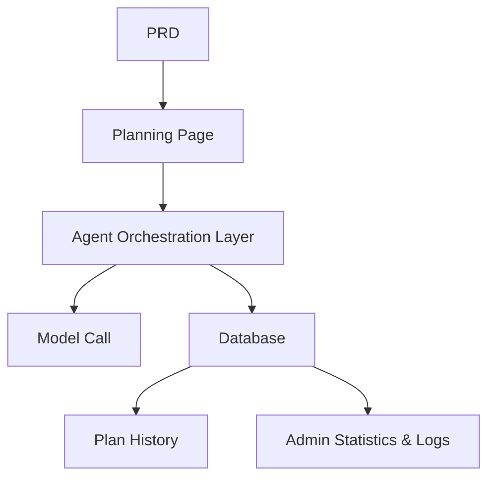

# 旅行规划代理平台

## 概述

该项目要求你从零开始构建一个基于真实PRD的智能旅行规划代理平台。你将构建一个完整的AI产品，接受结构化输入，生成每日行程，并支持保存和重复使用计划——不仅仅是一个聊天机器人，更是一个具备任务管理功能的产品。

这是第二阶段的全面实践部分。核心挑战：如何让AI生成结构化、可操作的行程，而不是一面非结构化的文字墙。

## 先修条件

在开始这个项目之前，你应该已经熟悉：

- 前端页面设计和组件库（[UI Design]（../../frontend/ui-design/）、[现代组件库]（../../frontend/modern-component-library/））
- 后端API设计与开发（[API代码]（../../后端/AI接口代码/））
- 数据库基础与 Supabase（[数据库到 Supabase]（../../backend/database-supabase/））
- Git 工作流程与部署（[Git & GitHub]（../../backend/git-workflow/）， [Web App 部署]（../../后端/zeabur-deployment/））

## 学习目标

完成该项目后，您将能够：

1. 读取PRD并提取代理平台的开发任务列表
2. 设计结构化输入表单和结构化输出格式
3. 实现一个代理编排层，处理用户输入、模型调用和结果存储
4. 建立“生成→节省→再利用”的业务循环
5. 完成端到端集成，交付可演示的AI产品原型

## 项目概述

你将构建一个智能旅行规划代理平台：

|特色 |描述 |
|---------|-------------|
|**行程规划** |用户输入出发地、目的地、日期、预算和偏好;系统生成每日行程 |
|**预算细分**行程结果包括预算分配和建议 |
|**历史管理** |用户可以保存、再生和导出过去的计划 |
|**管理员仪表盘** |管理员查看热门目的地、失败任务和用户反馈 |

::: 提示PRD
该项目的需求文档可在GitHub上：[查看PRD]（https://github.com/datawhalechina/easy-vibe/blob/main/docs/en/stage-2/assignments/travel-planning-agent-platform/PRD.md）
:::

<div style=“margin： 32px 0;”>
  <ClientOnly>
    <StepBar ：active=“0” ：items=“[ { title： 'Requirements'， description： '阅读PRD，定义页面、代理编排和输入/输出结构'}， { title： 'Scaffold'， description： '用AI生成主页、规划、历史和管理页面骨架'， { 标题： '迭代'， 描述： '按模块添加结构化输出、任务状态和历史管理模块'， { 标题： '启动'， 描述： '端到端测试、部署和准备演示' } ]” />
  </ClientOnly>
</div>

## 第一部分：需求分析

### 1.1 阅读PRD

打开PRD文件，回答以下关键问题：

- 第一个版本是否应该只支持单一目的地行程？
- 行程输出必须有结构化吗？结构是什么？
- 导出能力应深入到多远？（分享链接 / PDF / 图片）
- 管理员统计和任务日志的范围是什么？

::: 警告
如果上述问题没有明确答案，就不要开始写代码。需求不明确是最常见的重做原因。
:::

### 1.2 确认系统架构



## 第2部分：项目脚手架

### 2.1 生成前端页面

提示参考：

```text
Based on the current PRD, help me generate a frontend scaffold for an intelligent travel planning Agent platform.

Requirements:
1. Pages: homepage, planning page, itinerary detail, history, admin dashboard
2. Planning page has a form on the left and result preview on the right
3. Only generate page structure with mock data first, no real API integration
4. Style should look like a modern AI product
```

### 2.2 验证页面结构

检查每一项：

- [ ] 规划页表单字段与PRD匹配
- [ ] 结果预览区可以显示结构化行程数据
- [ ] 历史页面可以显示多个图纸
- [ ] 管理仪表盘可以显示统计数据

## 第三部分：迭代开发

### 3.1 模块逐模块进展

1. **认证**：注册，登录
2. **规划表**：结构化输入（起点、目的地、日期、预算、偏好）
3. **代理编排**：接收输入→调用模型→解析结构化输出
4. **结果显示**：按天显示行程、预算分解、建议
5. **历史管理**：保存计划、再生、导出
6. **管理仪表盘**：热门目的地、失败任务、用户反馈
7. **任务状态**：生成/成功/失败状态管理及错误记录

### 3.2 模块自我检查

|检查项目 |验证方法 |
|------------|---------------------|
|输入完整性 |表单字段是否符合PRD？|
|输出结构 |行程结果是结构化数据（不是一大段文字）吗？
|数据一致性 |行程、行程和日志数据是否对齐？|
|循环验证 |你能演示“输入→生成→保存→再生”吗？

## 第四部分：整合与启动

### 4.1 端到端测试

至少，请核实以下情景：

- 输入行程参数 → 生成每日行程 → 查看预算明细 → 保存到历史
- 历史重塑行程
- 管理员查看任务统计和故障日志

## 交付成果

完成本项目后，请提交以下内容：

- [ ] 可访问的现场演示链接
- [ ] 源代码仓库链接（含 README）
- [ ] PRD文件
- [ ] 核心页面截图（规划页面、行程详情、历史、管理仪表盘）
- [ ] 60秒演示视频

## 评分标准

|尺寸 |基本需求 |高级需求 |
|------------|-------------------|----------------------|
|PRD 对齐 |页面、功能和数据结构基本符合 PRD |能清晰解释设计决策 |
|产品循环 |计划 → 保存 → 历史 → Regenerate 从端到端工作 |支持导出和共享 |
|输出质量 |行程结果结构清晰且易读 |预算细分合理，建议相关 |
|管理能力 |可查看任务统计和故障日志 |拥有热门目的地分析 |
|工程完整性 |前端、后端、数据库、模型调用流水线连接 |任务状态管理稳健，错误可追溯 |

## 参考文献

- [UI设计]（../../frontend/ui-design/）
- [现代组件库]（../../frontend/modern-component-library/）
- [数据库至Supabase]（../../backend/database-supabase/）
- [API 代码与 LLM 辅助]（../../backend/ai-interface-code/）
- [Git 和 GitHub 工作流程]（../../backend/git-workflow/）
- [Web 应用部署]（../../后端/zeabur-deployment/）