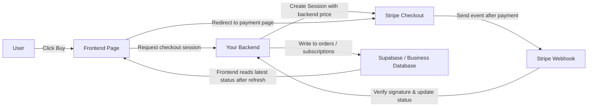
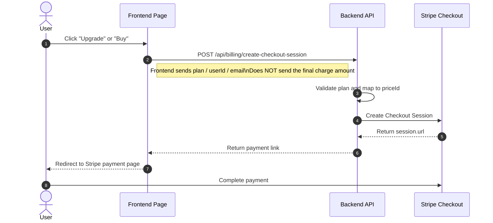
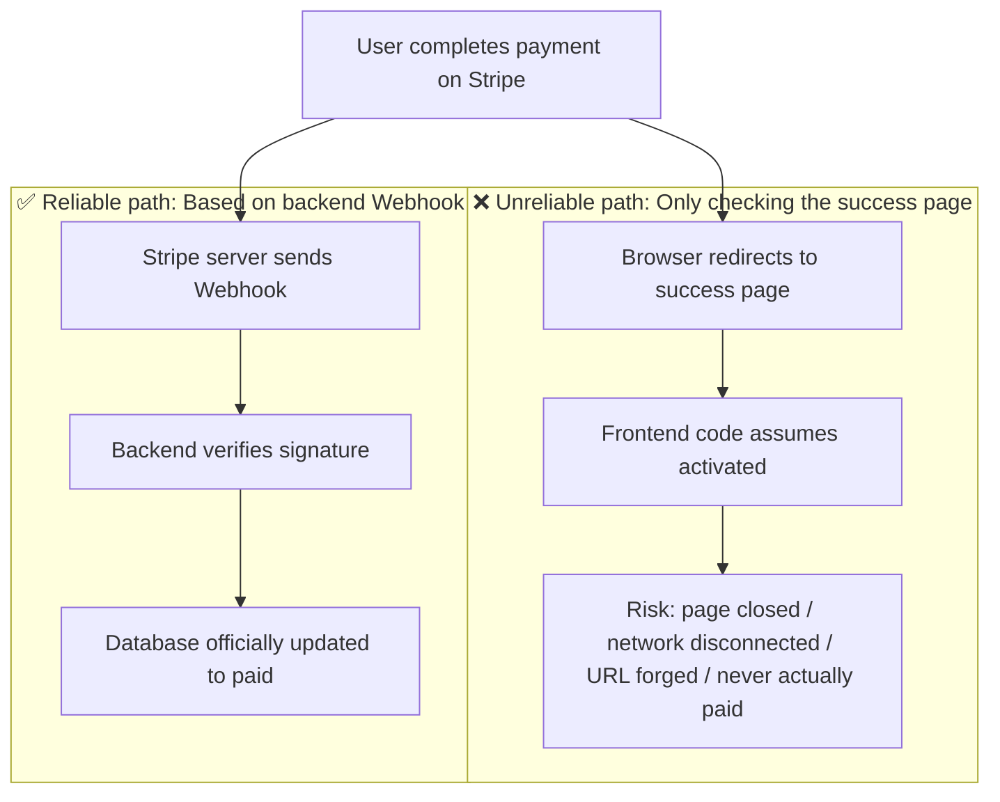
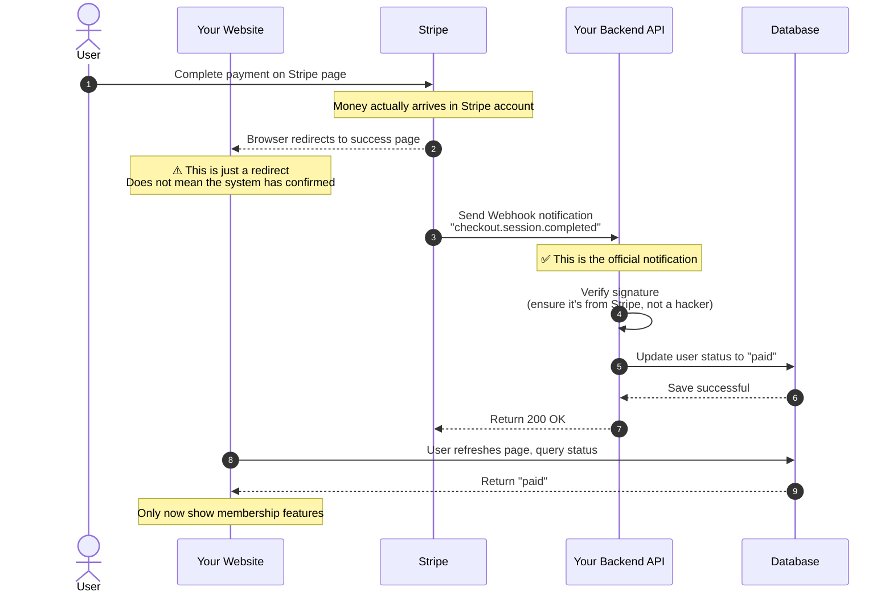
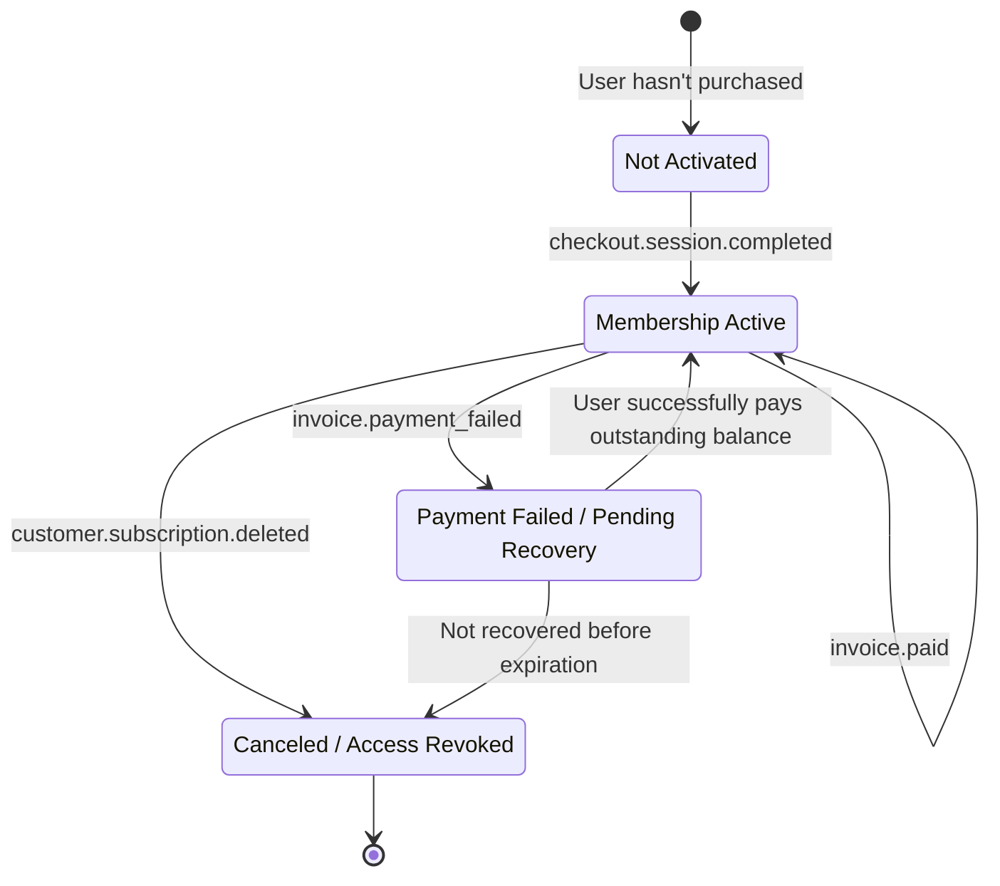
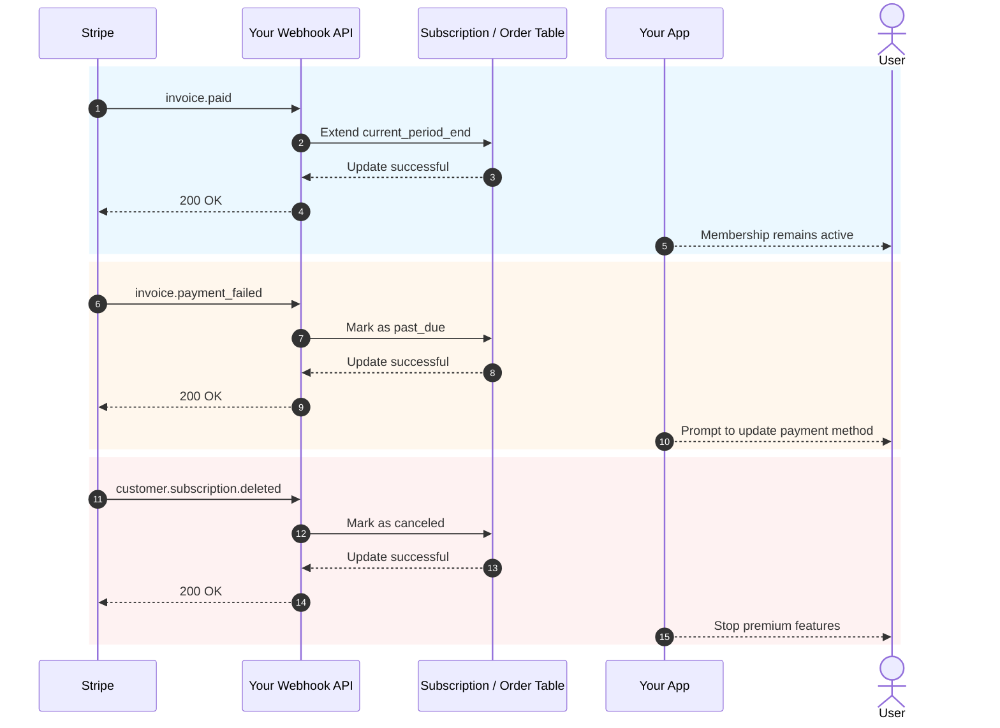

# 如何集成 Stripe 和其他计费系统

当你的产品已经有页面、认证、数据库和基础后端时，下一个实际问题是：**如何收费**。

很多人在第一次进行支付集成时，完全专注于“如何跳转到支付页面”。但真正决定系统是否稳定的不是按钮——而是整个计费链：谁决定价格，谁确认支付成功，谁更新数据库，以及谁授予或撤销访问权限。

本文分为两部分：

- **前半部分**仅涵盖最实用的基础内容，目标是帮助你尽快将 Stripe 集成到项目中。
- **后半部分**合并在附录中，涵盖 Webhook 细节、订阅事件，以及不同国家和地区支付解决方案的差异。

> 💡 我们建议在继续之前完成以下章节：
>
> - [从数据库到 Supabase](../database-supabase/)
> - [使用 AI 编写 API 代码和文档](../ai-interface-code/)
> - [如何部署 Web 应用](../zeabur-deployment/)

# 你将学到的内容

1. 最小可行支付系统的样子。
2. 如何以最快的方式将 Stripe 集成到你的项目中。
3. 如何编写提示词，让 AI 直接为你添加支付系统。
4. 如果你没有建立海外 Stripe 项目，不同地区应优先考虑哪些支付解决方案。

---

# 第 1 部分：入门

## 1. 首先记住这三个原则

如果你只记住三件事，请记住这些：

1. **价格必须由后端决定**——永远不要信任前端发送的金额。
2. **真正授予访问权限的是 Webhook**，而不是 `success` 页面。
3. **你自己的数据库必须存储支付状态**——不要仅依赖 Stripe 控制面板。

这三个原则是任何支付系统的核心边界。只要边界正确，在 Stripe、PayPal、支付宝或微信支付之间切换，本质上只是“API 变化，但架构不变”。

## 2. 如果跳过后端，直接从前端连接会发生什么？

这是很多人在第一次构建支付时最自然的想法：

- 页面上已经有一个“购买”按钮
- 我能否让前端直接连接 Stripe？
- 这样我就不需要后端了，对吗？

如果你只是做一个假的演示页面，这种思路没问题。但如果你真正收取真钱，**这种方法通常会导致问题**。

最常见的问题是：

1. **价格很容易被篡改**
   浏览器的请求来自用户自己的电脑，其他人可以修改请求内容。
2. **敏感信息可能泄露**
   真的重要的密钥、定价逻辑和会员激活逻辑绝不应该放在前端。
3. **无法可靠确认“支付是否真的成功”**
   用户进入成功页面并不意味着你的数据库已正确同步。
4. **数据库状态会不一致**
   用户可能说“我已经付过了”，但你的系统没有记录。

所以更安全的分工应该是：

- 前端负责：显示按钮、发起购买、页面跳转
- 后端负责：确定价格、创建支付会话、接收 Webhook、更新数据库

::: info 你可以用一句话总结  
**前端可以处理重定向；后端必须处理定价和确认。**  

只要涉及真钱支付，绝不要将“最终定价权”和“支付后激活逻辑”放在前端。  
:::

## 3. 什么时候适合从 Stripe 开始？

如果你正在构建以下任意一种场景，Stripe 通常是最顺利的起点：

- 面向国际用户的 SaaS  
- 基于订阅的会员产品  
- 数字产品、模板、AI 点数包  
- 希望快速验证盈利模式，而不是一开始就处理过多本地支付细节  

如果你的主要用户在中国大陆，Stripe 通常不会是你的首选——我将在附录中说明。

## 4. 最小可行支付链

我们从最小版本开始。只要这条链条能工作，你的支付系统就有了骨架。



将其翻译成通俗语言：

1. 用户点击一个按钮。
2. 前端向后端请求一个付款链接。
3. 后端使用 Stripe 密钥创建付款会话。
4. 用户前往 Stripe 页面进行支付。
5. Stripe 通过 Webhook 通知您“付款实际上成功”。
6. 然后您的后端更新数据库。

## 5. 发起支付的标准顺序图

如果您更喜欢查看更正式的系统图，下面是顺序图：



## 6.快速入门

如果你想尽快把它整合进你的项目，只需遵循以下5个步骤。

### 6.1 步骤1：在Stripe仪表盘中创建产品和价格

这一步的目的不是“随便配置某个东西”——而是在Stripe里明确定义你卖什么以及你打算如何收费。

在Stripe的模型中：

- **产品**代表“你正在销售的东西”，例如`Pro Membership`
- **价格**表示“成本及计费周期”，例如`$9.9/month`、`$99/year`

为什么要先做这一步？
因为后台创建结账会话时，你不会把原始金额传递给Stripe——而是传递一个现有的`price_id`。Stripe随后利用这个`price_id`生成实际的付款页面、金额、货币和计费周期。

如果你跳过这一步，之后的“创建付款链接”步骤就完全无法使用了。

::: 信息 为什么要在这里停顿
许多初学者看到`Product`和`Price`时会感到烦躁，以为自己在学Stripe的内部术语。

但实际上，这一步做的事情非常简单：
- 明确定义“你所销售的东西”
- 明确定义“费用”
- 让后端以后使用稳定的 `price_id` 来创建支付链接

一旦你理解了这一层，结账会话就不会显得抽象。
:::

对于最低可行订阅系统，至少需要这两个级别：

- 一个 `Product`
- 一篇或多件 `Price`@ 条目

您可以直接打开这些页面：

- Stripe 仪表盘登录：[仪表盘登录]（https://dashboard.stripe.com/login）
- Stripe产品与价格管理文档：[管理产品和价格]（https://docs.stripe.com/products-prices/manage-prices）
- Stripe 结账快速入门文档：[构建 Stripe 托管结账页面]（https://docs.stripe.com/checkout/quickstart?lang=node）
- Stripe 仪表盘产品页面：[产品目录]（https://dashboard.stripe.com/test/products）

我们建议先在**测试模式**下运行——不要在现场环境中开始构建。

典型的最小配置如下：

- `Product`: `Pro Plan`
- `Price 1`: `pro_monthly`
- `Price 2`: `pro_yearly`

在仪表盘操作时，请按照以下顺序操作：

1. 先创建一个产品 `Pro Plan`
2. 然后将两个价格附加在该乘积下
3. 月计费和按年计费其实就是同一产品的两种定价选项

完成后，你至少需要记录：

- 按月费计算的`price_id`
- `price_id` 按年度价格计算
- 你自己的计划名称，例如 `pro_monthly`， `pro_yearly`

如果你是第一次使用Stripe仪表盘，可以这样理解：

- `Product` 决定支付页面上销售的内容
- `Price` 决定支付页面上的收费金额
- 后端实际以后实际使用的主要是 `price_id`

::: 信息 你实际上需要记下的数值
本页最重要的不是产品名称，而是`price_id`。

以后，无论你是让AI帮忙集成后端，还是自己排查问题，你经常会用到的是：
- `STRIPE_PRICE_PRO_MONTHLY`
- `STRIPE_PRICE_PRO_YEARLY`
- 对应的两个 `price_id` 值
:::

如果你想让AI先带你完成仪表盘配置，可以使用这个提示：

```text
I'm using Stripe for the first time. Don't modify any code yet -- first help me set up the most basic billing configuration in the Stripe Dashboard.

Please give me step-by-step instructions based on these official docs:
- https://docs.stripe.com/products-prices/manage-prices
- https://docs.stripe.com/checkout/quickstart?lang=node

My situation:
- I want to build the simplest membership billing
- Only two plans: monthly and yearly
- I don't understand terms like Product and Price yet

Please:
1. First explain in simple terms what Product and Price are.
2. Then guide me step by step: which page to open first -> what to click -> what to fill in.
3. Finally remind me what I need to copy from the Dashboard for the backend to use.
4. If I might make mistakes, please remind me to always stay in test mode.
```

### 6.2 步骤 2：准备环境变量

你通常至少需要以下环境变量：

- `STRIPE_SECRET_KEY`
- `STRIPE_WEBHOOK_SECRET`
- `STRIPE_PRICE_PRO_MONTHLY`
- `STRIPE_PRICE_PRO_YEARLY`
- `APP_URL`
- `SUPABASE_URL`
- `SUPABASE_SERVICE_ROLE_KEY`

你可以直接打开这些页面：

- Stripe API 密钥文档: [API keys](https://docs.stripe.com/keys)
- Stripe 仪表板 API 密钥页面: [API Keys](https://dashboard.stripe.com/test/apikeys)
- Stripe Webhooks 文档: [在你的 webhook 端点接收 Stripe 事件](https://docs.stripe.com/webhooks)
- Stripe 仪表板 Webhooks 页面: [Workbench Webhooks](https://dashboard.stripe.com/test/workbench/webhooks)

> ⚠️ `STRIPE_SECRET_KEY` 和 `SUPABASE_SERVICE_ROLE_KEY` 只能放在后端。

::: info 环境变量步骤的目的
此步骤并不是“填充 `.env` 文件”——而是把支付系统中最敏感的部分放在后端：

- Stripe 的后端私钥
- Webhook 签名验证密钥
- 你自己的价格映射

简单来说：
前端只负责发起购买；真正的密钥和定价逻辑应保留在服务器端。
:::

你也可以让 AI 帮助组织这一步骤：

```text
Please look at how my project currently stores environment variables, then help me organize the environment variables needed for Stripe.

Please refer to these docs:
- https://docs.stripe.com/keys
- https://docs.stripe.com/webhooks

My situation:
- I'm a complete beginner
- I can't distinguish which variables should go on the frontend vs the backend
- I'm not sure whether to edit `.env`, `.env.local`, or another file in the current project

Please:
1. First search where environment variables are typically stored in the current project.
2. List the minimum environment variables needed for Stripe integration.
3. Explain in simple terms what each variable does.
4. Tell me which Stripe page to visit to copy each variable.
5. If the project has an example environment variable file, please add the variable names directly.
```

### 6.3 步骤 3：在后端创建结账会话

你不需要自己编写 API —— 只需让 AI 参考官方文档并为你实现即可。

首先，提供这些文档给它：

- Stripe 结账快速入门：[创建一个由 Stripe 托管的结账页面](https://docs.stripe.com/checkout/quickstart?lang=node)
- 结账会话 API：[创建结账会话](https://docs.stripe.com/api/checkout/sessions/create)
- 订阅：[订阅](https://docs.stripe.com/payments/subscriptions)

然后粘贴此提示：

```text
Please look at how my current project's backend code is organized, then help me integrate Stripe payments.

Please refer to these official docs:
- https://docs.stripe.com/checkout/quickstart?lang=node
- https://docs.stripe.com/api/checkout/sessions/create
- https://docs.stripe.com/payments/subscriptions

My goal is simple:
- After the user clicks the buy button, redirect to Stripe's payment page
- Only two plans: monthly and yearly
- Don't make me decide where to put the code -- look at the project first and place it appropriately

Please:
1. First search the project to find the backend entry file, route files, and how environment variables are written.
2. Then reference the official docs to integrate the "create Stripe payment link" step.
3. Don't let me pass the amount myself -- use backend environment variables for pricing.
4. After finishing, tell me which files you changed.
5. Finally, tell me what additional configuration I need to do in the Stripe Dashboard.
```

### 6.4 第4步：从前端重定向到支付页面

这一步的目标非常简单：让定价页面按钮调用你的后端 API，然后重定向到 Stripe 结账页面。

参考文档：

- Stripe 结账集成指南：[与 Checkout 构建集成](https://docs.stripe.com/payments/checkout/build-integration)

AI 提示：

```text
Help me connect the "Buy" button in my project to Stripe.

Requirements:
- Don't change the existing page, only modify the button click logic
- After clicking, call the backend API to get the payment link, then redirect to Stripe
- If there's an error, show a simple message to the user (e.g. "Payment temporarily unavailable, please try again later")

Reference docs: https://docs.stripe.com/payments/checkout/build-integration
```

### 6.5 第5步：通过 Webhook 更新数据库状态

这是最关键的一步。

::: info 为什么这一步最关键
许多人认为“用户已付款并被重定向到成功页面”意味着一切都完成了。

不。

对你的系统来说，重要的是：
**Stripe 是否已正式将事件发送到你的 Webhook，以及你的后端是否已成功更新数据库状态。**
:::

你也可以让 AI 直接按照 Stripe 官方 Webhook 文档来实现——不要手动编写。

参考文档：

- Stripe Webhooks: [在你的 webhook 端点接收 Stripe 事件](https://docs.stripe.com/webhooks)
- Stripe CLI: [Stripe CLI](https://docs.stripe.com/stripe-cli)
- Stripe CLI 使用方法: [使用 Stripe CLI](https://docs.stripe.com/stripe-cli/use-cli)

AI 提示:

```text
Please continue helping me integrate the "automatically activate after successful payment" step with Stripe.

Please refer to these official docs:
- https://docs.stripe.com/webhooks
- https://docs.stripe.com/stripe-cli
- https://docs.stripe.com/stripe-cli/use-cli

My goal:
- After the user pays, don't just redirect to a success page
- Actually change the membership status in my database to activated

Please:
1. First search the current project for database-related code and how user status is stored.
2. Then add the Stripe webhook.
3. After successful payment, change the corresponding user to active, or update the membership status field currently used in the project.
4. If the project already has subscription tables, order tables, or user tables, prefer to follow the existing structure.
5. After finishing, tell me which files you changed.
6. Also tell me how to test locally whether this step actually works.
```

## 7. 提示：让 AI 快速集成支付

如果你正在使用 Codex、Claude Code、Trae 或 Cursor 等工具，你可以直接粘贴以下提示，让它将支付功能集成到你的项目中。

```text
Please help me integrate Stripe payments into the current project. I want to build the simplest membership billing feature that works.

My requirements:
1. I'm a complete beginner -- please look at the project yourself first, then decide where to modify the code.
2. Don't make me figure out the directory structure, routing structure, or database structure myself.
3. I only want the simplest version first: two plans, monthly and yearly.
4. After clicking buy, the user should be redirected to the Stripe payment page.
5. After successful payment, the membership status in my database should change to activated.
6. Don't add too many complex features upfront, like coupons, upgrades/downgrades, or complex invoicing.

Output requirements:
1. First give me a change plan.
2. Then directly modify the code.
3. Finally tell me how to test step by step locally.
4. If any step requires me to do something in the Stripe Dashboard, give me the link and key points directly.
```

如果你希望 AI 更加贴合你的项目，你也可以在开始时添加：

- 你的前端框架
- 你的后端目录结构
- 你的数据库表名
- 你当前的用户系统是使用 Supabase Auth 还是自定义的 Auth 解决方案

## 7.1 让 AI 也处理本地集成测试

如果你希望 AI 引导你完成整个本地集成测试过程，你可以使用这个提示：

```text
Please continue helping me get Stripe payments actually working. I want to follow along step by step without guessing.

Please refer to the official docs:
- https://docs.stripe.com/webhooks
- https://docs.stripe.com/stripe-cli
- https://docs.stripe.com/stripe-cli/use-cli

My goals:
1. Tell me which Stripe pages to open first.
2. Tell me how to get the STRIPE_WEBHOOK_SECRET.
3. Tell me how to use stripe login and stripe listen.
4. Tell me how to verify that checkout.session.completed has successfully reached my local webhook.
5. If the current project needs the frontend and backend running first, tell me the specific commands too.
6. Don't just explain principles -- output actual step-by-step instructions.
7. If I might make a mistake at some step, also tell me what the most common errors look like.
```

## 8.最常见的四大陷阱

1. **将`success`页面视为付款成功**
   真正决定状态的是Webhook，而不是前端重定向。
2. **让前端传递金额**
   这带来了严重的价格操纵风险。
3. **Webhook路由由`express.json()`**预处理
   Stripe 签名验证需要原始请求体。
4. **未实现幂等处理**
   Webhooks可以重试。如果你每次重试都加会员或积分，就会出现问题。

## 9.一句话选择指南

如果你现在只想让账单系统正常运行：

|你的主要用户 |首个解决方案 |
|:--- |:--- |
|国际SaaS / 全球用户 |Stripe |
|中国大陆用户 |支付宝 / 微信支付 |
|香港或跨境团队 |Stripe 本地钱包 / FPS 聚合解决方案 |

具体差异详见附录。

::: 信息 选择支付解决方案的最简单方法
不要一开始就想着“我需要一次性整合所有支付方式”。

更实用的顺序通常是：
- 首先根据你主要用户所在的位置选择一条主要支付链
- 先让最低可行还款项正常运作
- 然后根据实际用户来源添加第二或第三种支付方式
:::

## 10.摘要

到目前为止，你已经掌握了最基础且最重要的账单链：

1. 前端发起购买。
2. 后端创建一个借阅会话。
3. 用户在Stripe页面付款。
4. Stripe 通过 Webhook 通知后端。
5. 后端更新数据库。
6. 刷新后，前端显示新的会员或订单状态。

如果你只是想快速将付款整合进你的项目，上面的内容就足够了。当你实际遇到问题时，可以参考下面的附录。

---

# 附录

## 附录A：Stripe中最常见的对象

第一次看Stripe文档时，很容易被这些对象名称弄混。你只需要理解以下内容：

|对象 |目的 |你能把它看作什么 |
|:--- |:--- |:--- |
|`Product` |描述你销售的产品 |产品或会员计划 |
|`Price` |描述价格和计费周期 |按月、按年或一次性购买 |
|`Checkout Session` |Stripe托管的支付流程 |支付页面 |
|`Subscription` |定期订阅关系 |自动续费会员 |
|`Customer` |付费用户 |Stripe 客户资料 |
|`Webhook` |异步通知 |Stripe 告诉你“这笔付款发生了什么”|

## 附录B：为什么`success`页面不等于付款成功

很多人以为“用户付款后被重定向到成功页面”意味着付款成功了。这是最常见的陷阱。

### 现实场景

想象你搭建了一个会员网站：
1. 用户点击“购买会员”
2. 重定向到 Stripe 付款页面
3. 用户输入信用卡信息并点击付款
4. 页面重定向到你的`success.html`
5. 你在成功页面写了代码：“既然他们到达了本页面，请激活他们的会员资格”

**出了什么问题？**

用户可能根本没有付款，或者在付款中途关闭了页面，但仍可直接访问`success.html`。

### 两条完全不同的道路



**主要区别：**

| | 成功页面重定向 | Webhook通知 |
| :--- | :--- | :--- |
| 发起方 | 用户的浏览器 | Stripe的服务器 |
| 可以伪造吗？ | 可以，只需直接访问URL | 不可以，有签名验证 |
| 是否保证支付成功？ | 不一定 | 是的，总是 |
| 系统如何知道？ | 前端代码猜测 | Stripe官方通知 |

### 完整流程应该是这样的



### 每一步可能出现的问题

**步骤 1：用户在 Stripe 付款**

这是唯一能够确认“钱款实际已支付”的时刻：
- 用户输入信用卡信息并点击确认
- 银行向用户的卡收费
- Stripe 确认收到资金

**步骤 2：浏览器重定向到成功页面（最有问题的步骤）**

这一步完全不可靠，因为：
- 用户可以直接在浏览器中输入 `yoursite.com/success`，在未付款的情况下访问
- 用户在支付过程中关闭页面，但之前复制了成功链接，之后再打开
- 网络问题导致重定向失败，但钱已经被扣（用户支付了但没看到成功页面）
- 用户点击返回按钮再次付款，但两次都会重定向到同一个成功页面

**步骤 3：Stripe 发送 Webhook**

这是 Stripe 主动通知你的服务器“已收到付款”：
- 只有 Stripe 的服务器可以发起此请求
- 请求中包含签名，后端可以验证其确实来自 Stripe
- 即使成功页面未加载或用户断开连接，Webhook 仍会发送

**步骤 4：后端验证签名**

为什么需要验证？为了防止黑客伪造通知。

如果不验证，黑客可以向你的服务器发送假通知：“用户 A 支付了 $1000。”你的系统就会为黑客激活会员。

验证过程：
- Stripe 使用共享密钥为通知内容生成签名
- 你的后端使用相同的密钥验证签名是否匹配
- 匹配 = 100%来自 Stripe，不匹配 = 立即拒绝

**步骤 5：更新数据库**

只有验证通过后，才更新数据库：
- 将用户状态从“待支付”改为“已支付”
- 记录订单号、金额和支付时间
- 激活相应的会员权限

**步骤 6：前端查询状态**

成功页面不应假设“访问此页面即表示成功”。正确做法：
- 页面加载时，发送请求到后端：“此用户是否已支付？”
- 后端查询数据库并返回实际状态
- 根据结果显示“激活成功”或“等待确认”

### 一个常见错误

```javascript
// Wrong: Activate directly on the success page
// success.html
if (window.location.pathname === '/success') {
  // Dangerous! Anyone can access /success
  activateMembership();
}
```

```javascript
// Correct: Always query the backend on every refresh
// success.html
async function checkStatus() {
  const response = await fetch('/api/user/status');
  const data = await response.json();

  if (data.paymentStatus === 'paid') {
    showMemberFeatures();
  } else {
    showPendingMessage();
  }
}
```

### 一句话总结

**成功页面只意味着“浏览器重定向成功”。Webhook 才意味着“Stripe 已正式确认收到付款”。**

您的系统必须使用 Webhook 作为事实来源——永远不要信任前端重定向。

## 附录 C：最重要的订阅事件监听

| 事件 | 含义 | 通常操作 |
| :--- | :--- | :--- |
| `checkout.session.completed` | 首次订阅激活成功 | 创建本地订阅记录 |
| `invoice.paid` | 自动续订成功 | 延长到期日期 |
| `invoice.payment_failed` | 自动扣款失败 | 标记风险状态并通知用户 |
| `customer.subscription.deleted` | 订阅取消 | 撤销访问权限或标记为已过期 |

### 订阅状态图



### 续订 / 失败 / 取消 时序图



## 附录D：如何选择其他支付解决方案

### 1.中国大陆

如果你的主要用户在中国大陆，首选仍然是**[支付宝]（https://open.alipay.com/）**和**[微信]（https://pay.wechatpay.cn/）**。

**商业模式：**

两者都采用“支付网关”模式。您需要：
- 申请商户资格（营业执照、企业银行账户）
- 用户付款直接进入您的商户账户
- 你自己处理税务、退税和对账

**技术模型：**

两者都采用“后端生成订单，前端触发支付后端接收通知”的模式，和Stripe一样。

**支付宝集成流程：**
1. 在支付宝开放平台上创建应用
2. 配置公钥/私钥及回调URL
3. 后端调用统一订单 API，生成支付链接或二维码
4. 用户扫描代码或被重定向支付
5. 支付宝会向你的后台发送异步通知，更新订单状态

**微信支付集成流程：**
- JSAPI支付：适用于官方账户和小项目;用户可直接在微信内支付
- 原生支付：在PC上生成二维码;用户扫描后付款
- H5支付：通过移动浏览器启动微信应用支付

流程：后端创建订单 -> 收到 `prepay_id` 或 `code_url` -> 前端触发付款 -> 后端收到确认成功的通知

**参考链接：**
- 支付宝开放平台：https://open.alipay.com/
- 微信支付商户文档：https://pay.wechatpay.cn/doc/v3/merchant/

### 2.香港

香港市场相当混合。常见组合：

- 银行卡：Visa / Mastercard
- FPS（快速支付系统）：香港本地即时转账系统
- 支付宝香港 / 微信支付香港：香港版的支付宝和微信

**推荐组合：**
- 使用**[Stripe]（https://stripe.com/hk）**处理国际卡和订阅
- 使用 **[Airwallex]（https://www.airwallex.com/）** 或 **[Adyen]（https://www.adyen.com/）** 来补充本地钱包和 FPS

### 3.国际/全球SaaS

#### [条纹]（https://stripe.com/）

**商业模式：** 支付网关

- 你需要自己申请商户资格认证（在某些国家，Stripe可以帮你办理）
- 用户付款先流到你的Stripe账户，然后结算到你的银行账户
- 你自己报税

**技术模型：**

- 最佳的API体验，清晰的文档
- 支持结账（托管页面）、Elements（自定义表单）、支付链接（无代码）
- 用于支付状态的Webhook通知
- 支持订阅、发票、多货币

**最适合：** 国际SaaS、独立开发者、需要灵活定制的团队

**参考链接：** https://docs.stripe.com/

#### [PayPal]（https://www.paypal.com/）

**商业模式：** 支付网关

- 用户付款会进入你的PayPal账户，然后你会取出到你的银行
- 你自己处理税务

**技术模型：**

- 一次性付款：在前端放置按钮，后台创建/确认订单
- 订阅：先创建产品和计划，然后使用 SDK 启动
- 还需要后端和Webhook——不要只依赖前端回调

**最佳用途：** 国际企业需要额外渠道，习惯用PayPal支付的用户

**参考链接：** https://developer.paypal.com/docs/

#### [桨]（https://www.paddle.com/）

**商业模式：** Merchant of Record（MoR）

- Paddle 是“记录商人”——法律上，Paddle 从用户那里收取付款
- Paddle为您处理全球税务、增值税、退税和合规事务
- 用户付款归 Paddle 所有;扣除税费后，Paddle 与您结算
- 你不需要在每个国家注册公司或处理税务

**技术模型：**

- Paddle.js：在前端嵌入托管的结账页面
- 后端API：创建交易，交给结账
- Webhook 订阅同步状态

**最适合：** 不想处理全球税务，尤其是B2B SaaS的SaaS团队

**参考链接：** https://developer.paddle.com/

#### [柠檬挤压]（https://www.lemonsqueezy.com/）

**商业模式：** Merchant of Record（MoR）

- 与Paddle类似，Lemon Squeezy是“记录商人”
- 为您处理全球税务、增值税和合规事务
- 2024年被Stripe收购，但独立运营

**技术模型：**

- 托管结账：最简单的选项——只需生成支付链接
- 结账叠加层：嵌入页面的叠加层
- 后端API：创建具有灵活控制的结账

**最适合：** 独立开发者、数字产品、软件授权

**参考链接：** https://docs.lemonsqueezy.com/

### 4.企业解决方案

#### [空中壁垒]（https://www.airwallex.com/）

**商业模式：** 支付网关全球账户

- 提供全球接收账户（类似于虚拟银行账户）
- 支持多货币收款、货币兑换和支付
- 你自己处理税务

**技术模型：**

- 支付链接：几乎不需要代码——生成支付链接
- 托管支付页面：托管页面
- 可直接嵌入/嵌入式/原生API：深度集成且高度定制化
- 支持支付宝香港、FPS、微信支付及其他本地支付方式

**最佳用途：** 香港团队、跨境企业、需要多币种账户的公司

**参考链接：** https://www.airwallex.com/docs/

#### [阿迪恩]（https://www.adyen.com/）

**商业模式：** 支付网关

- 企业级支付平台，年交易量达数万亿欧元
- 支持在线、离线和移动全渠道支付
- 你自己处理税务

**技术模型：**

- 按链接付款：最简单的选项——生成支付链接
- 可直接应用 / 组件：标准在线集成
- 仪表盘可启用支付宝、支付宝香港、PayMe及其他本地支付方式

**最适合：** 大型企业、需要全渠道支付的公司

**参考链接：** https://docs.adyen.com/

### 5.解比较

|解决方案 |商业模式 |税务处理 |最佳方案 |
|:--- |:--- |:--- |:--- |
|Stripe |支付网关 |自己管理 |国际SaaS，开发者 |
|PayPal |支付网关 |自己处理好 |国际补充渠道 |
|拨款 |MoR |拨片手柄 |B2B SaaS，不想管理税务 |
|柠檬挤压 |MoR |LS 手柄为你服务 |独立开发者，数字产品 |
|Adyen |支付网关 |自我管理 |大型企业 |
|Airwallex |支付网关账户 |自我管理 |跨境企业，香港团队 |
|支付宝/微信 |支付网关 |自己照顾好自己 |中国大陆用户 |

### 6.按地区选择

| 您的市场 | 推荐方案 |
| :--- | :--- |
| 中国大陆 | 支付宝 / 微信支付 |
| 香港 | Stripe / Airwallex / Adyen |
| 国际SaaS | Stripe（自行管理税务）或 Paddle（MoR 处理税务） |
| 国际数字产品 | Stripe / Lemon Squeezy / Paddle |
| 多地区企业 | Adyen / Airwallex / Stripe 组合 |