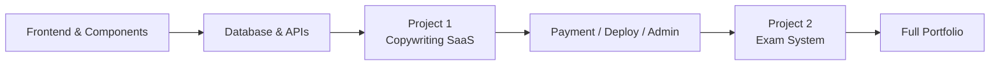

# 初级开发者

欢迎来到 **初级开发者** 阶段！在这里，你将深入学习全栈开发，并掌握现代前端工作流、数据库设计、后端 API、部署以及 AI 驱动的产品构建。

## 你将学习的内容

### 前端开发

掌握现代前端开发，学习如何使用设计工具、组件库和 AI 原生 UI 工作流：
<NavGrid>
  <NavCard
    href="/en/stage-2/frontend/lovart-assets/"
    title="前端 0：使用 Lovart 构建自己的资源生成代理"
    description="使用 Nanobanana 和 Lovart 批量生成高质量视觉资源，然后构建具有意图识别功能的绘图代理"
  />
  <NavCard
    href="/en/stage-2/frontend/figma-mastergo/"
    title="前端 1：Figma 与 MasterGo 基础"
    description="掌握专业 UI 设计工具的基本操作及从设计到代码的工作流程"
  />
  <NavCard
    href="/en/stage-2/frontend/multi-product-ui/"
    title="前端 2：UI 指南与多产品设计"
    description="学习主流 UI 设计指南，提高产品设计的一致性和美观性"
  />
  <NavCard
    href="/en/stage-2/frontend/llm-skills-beautiful/"
    title="前端 3：使用 LLM 与 Skills 美化界面"
    description="在实际项目中使用提示和插件，使 AI 生成更精致、独特的界面"
  />
  <NavCard
    href="/en/stage-2/frontend/hogwarts-portraits/"
    title="前端 4：让我们来构建霍格沃茨画像"
    description="实践项目：使用 AI 生成的图像构建交互式霍格沃茨画像应用"
  />
  <NavCard
    href="/en/stage-2/frontend/design-to-code/"
    title="前端 5：从设计原型到项目代码"
    description="学习如何将设计原型转换为能够在浏览器中真正运行的前端代码"
  />
  <NavCard
    href="/en/stage-2/frontend/modern-component-library/"
    title="前端 6：使用现代组件库升级你的 UI"
    description="使用组件库更快速地构建专业界面"
  />
</NavGrid>

### 后端开发

学习 API 设计、数据库管理和应用部署策略：
<NavGrid>
  <NavCard
    href="/en/stage-2/backend/database-supabase/"
    title="后端 1：从数据库到 Supabase"
    description="掌握关系型数据库基础，并学习使用现代 BaaS 平台 Supabase"
  />
  <NavCard
    href="/en/stage-2/backend/ai-interface-code/"
    title="后端 2：后端 API 设计与开发"
    description="使用 AI 帮助生成后端接口代码和标准 API 文档"
  />
  <NavCard
    href="/en/stage-2/backend/git-workflow/"
    title="后端 3：学习 Git 和 GitHub"
    description="掌握核心版本控制操作及 Git 协作工作流程"
  />
  <NavCard
    href="/en/stage-2/backend/zeabur-deployment/"
    title="后端 4：发布你的产品原型"
    description="学习使用 Zeabur 快速将全栈应用部署到云端"
  />
  <NavCard
    href="/en/stage-2/backend/modern-cli/"
    title="后端 5：从 IDE 到 CLI AI 编码工具"
    description="探索现代 CLI 工具以提升命令行开发体验"
  />
  <NavCard
    href="/en/stage-2/backend/stripe-payment/"
    title="后端 6：集成 Stripe 和其他支付系统"
    description="实践：将 Stripe 支付功能集成到应用中以实现变现"
  />
</NavGrid>

### 主要项目

前面的章节教授你“零件”。主要项目教你“如何将这些零件组装成可运行、可演示并可发布的产品”。

我们建议按顺序完成它们：**项目 1 → 项目 2**：

- **项目 1** 带你了解最常见的 SaaS 流程：登录、生成、数据库、支付和管理后台。
- **项目 2** 将你带入更类似业务系统的场景：基于角色的权限、题库、考试、提交和管理后台管理。

如果你不确定从哪一个开始，这里有一个快速对比：

| 项目 | 关键技能 | 适合对象 | 可交付成果 |
|---------|-----------|----------|-------------|
| 项目 1：文案网站 | SaaS 页面结构、用户登录、AI 生成、Stripe 支付、管理后台 | 第一次构建完整商业网站的人 | 可注册、可生成、可支付、可管理的 SaaS 原型 |
| 项目 2：考试与管理系统 | 角色权限、题库建模、考试流程、提交、评分与统计 | 想要构建完整“业务系统”的人 | 具有学生和管理员门户的考试平台 |

无论你选择哪一个，请至少准备以下三个可交付成果：

- 可运行的项目仓库
- 可访问的演示链接
- README 和演示视频

<NavGrid>
  <NavCard
    href="/en/stage-2/assignments/copywriting-platform-supabase/"
    title="项目 1：你的第一个 SaaS 全栈应用 - AI 文案网站"
    description="从零开始构建 AI 营销文案工作区，包括登录、生成、计费和管理后台"
  />
  <NavCard
    href="/en/stage-2/assignments/exam-management-express/"
    title="项目 2：在线考试与管理系统"
    description="构建在线考试系统，包含自动生成题目、考试流程和管理员管理功能"
  />
</NavGrid>

如果你已经完成了上述两个主要项目，或者想按自己的方向构建作品集，可以选择以下扩展项目进行深入学习：

<NavGrid>
  <NavCard
    href="/en/stage-2/assignments/modern-landing-page/"
    title="扩展：现代 AI 图像生成 SaaS"
    description="构建一个类似 Midjourney 的 AI 图像 SaaS，包括生成工作区、画廊、支付和管理后台"
  />
  <NavCard
    href="/en/stage-2/assignments/custom-dify-agent-platform/"
    title="扩展：自定义 Dify 代理平台"
    description="实现代理管理、对话、日志记录和权限控制的最小可行 AI 平台"
  />
  <NavCard
    href="/en/stage-2/assignments/travel-planning-agent-platform/"
    title="扩展：旅行规划代理平台"
    description="构建 AI 旅行规划产品，包含结构化输入、代理协调和计划历史管理"
  />
  <NavCard
    href="/en/stage-2/assignments/movie-recommendation-springboot/"
    title="扩展：Spring Boot 电影推荐系统"
    description="构建完整推荐系统，包含 Spring Boot、评分、收藏以及可解释的推荐功能"
  />
  <NavCard
    href="/en/stage-2/assignments/simple-grocery-microservices/"
    title="扩展：杂货电商微服务"
    description="练习服务拆分、网关路由以及库存与订单在微服务架构中的协调"
  />
  <NavCard
    href="/en/stage-2/assignments/traffic-data-visualization-go/"
    title="扩展：Go 交通数据分析与可视化"
    description="构建完整数据产品，包括数据摄取、窗口聚合、趋势仪表盘和告警"
  />
</NavGrid>

### AI 能力扩展
<NavGrid>
  <NavCard
    href="/en/stage-2/ai-capabilities/dify-knowledge-base/"
    title="AI 1：Dify 基础与知识库集成"
    description="学习使用 Dify 构建 AI 应用，并集成私有知识库"
  />
</NavGrid>

## 适合人群

- 有一定编程基础、希望系统学习现代全栈开发的开发者
- 从产品经理转型为全栈工程师的学习者
- 希望掌握现代开发工具和工作流程的初级到中级开发者
- 希望独立开发完整产品的创业者

## 先决条件

- 完成“新手与产品原型”阶段，或具备同等基础知识
- 了解基本的 HTML/CSS/JavaScript 概念
- 对 AI 编程工具有基本了解

准备好从产品原型阶段迈向真正的全栈交付吗？使用左侧导航开始学习。