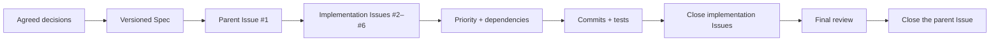
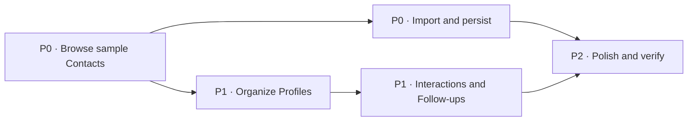

# 使用 GitHub Issues 构建端到端软件：从产品对话到 macOS 应用

本教程遵循完整的规范驱动开发周期。我们从一个粗略的产品想法开始，通过 AI 助手进行澄清，将达成的共识形成书面规范，发布优先级排序的 GitHub Issues，按依赖关系实现它们，并审查完成的软件。

::: info 这与上一章有什么不同？

[从 Vibe 编码到规范编码](/en/stage-3/core-skills/spec-coding/) 解释了为什么规范正在成为 AI 开发的核心。本章是实践指南：一个真实的公共仓库展示了规范如何变成 Issues、依赖关系、提交、测试以及可用产品。

:::

我们的起点是一句话：

> 我想构建一个 macOS CRM，帮助我管理导入的联系人并了解我的关系。我们可以先使用示例数据。

结果是 **Relationship Compass**，一款本地 macOS 应用，可以搜索和过滤联系人、编辑关系档案、导入 CSV 文件、记录互动，并计算谁需要跟进。


探索完整的 [公共示例仓库](https://github.com/sanbuphy/relationship-compass-macos)。它只包含示例数据，并保留了规范、Issues、提交历史、源代码和测试。

## 1. 规范驱动开发的含义

一个常见的 AI 编码循环如下：

```text
Describe an idea → AI writes code → something is wrong → add another instruction → modify again
```

这对于一个小页面是可行的。然而，随着项目的发展，早期的需求会在讨论中消失，大规模的更改变得难以追踪，某个功能可能运行了，但实际上并没有满足最初的请求。

Matt Pocock 的技能通过为代理提供可重复的工作流程来解决这个问题。**技能**告诉代理需要确立什么、需要产生什么产物，以及何时停止以进行确认——而不仅仅是写哪段代码。

### 1.1 以聊天为先与以规范为驱动的工作

| 以聊天为先的实现 | 以规范为驱动的实现 |
| --- | --- |
| 当前对话是主要的事实来源 | 版本化的规范是事实来源 |
| 新需求以非正式方式附加 | 范围变更首先更新规范和任务 |
| 进展记录在代理摘要中 | 进展记录在问题和提交中 |
| “它能运行”是主要完成信号 | 每个验收标准都被检查 |

目标不是文书工作。而是将意图转化为人类和代理可以检查、更新和验证的共享、持久的标准。

### 1.2 GitHub 在工作流程中的作用

在这里，GitHub 不仅仅是代码存储。它同时是：

1. 一个用于规范、术语和架构决策的**项目档案**；
2. 一个展示问题、优先级和依赖关系以表达工作顺序的**任务板**；
3. 一个显示发生了什么的**完成记录**，包括提交、测试、评论和关闭的问题。

| GitHub 工件 | 通俗含义 | 示例 |
| --- | --- | --- |
| 规范 | 完成的软件必须做的事情 | `specs/relationship-compass-mvp.md` |
| 问题 | 一个独立可交付的任务 | `#2 Browse sample Contacts` |
| 依赖 | 哪个任务必须先完成 | `#3` 被 `#2` 阻塞 |
| 提交 | 在一次实现步骤中发生的更改 | `feat: browse sample contacts` |
| 测试 | 行为仍然有效的证据 | `swift test` |
| 架构决策记录 (ADR) | 做出重要技术选择的原因 | `docs/adr/0002-native-swiftui-macos.md` |



因此，GitHub 成为了一个具有记忆功能的开发工作空间。新的会话可以在不重放整个对话的情况下重建项目的决策和当前前沿。

### 1.3 完整路线

此示例使用了五个技能：

1. `grill-with-docs` 明确产品和技术边界；
2. `to-spec` 将协议写成正式规范；
3. `to-tickets` 创建优先级和依赖关系明确的 GitHub Issues；
4. `implement` 一次完成一个准备好的 Issue；
5. `code-review` 检查代码健康状况和需求覆盖情况。

```text
Idea → clarify → specify → create tickets → implement → review
```

## 2. 在你开始之前

要复现示例，请准备：

- 一个 GitHub 账户；
- 在终端中认证的 GitHub CLI (`gh`)；
- Node.js 18 或更高版本；
- 一个可以加载项目技能的 AI 编程工具；
- 如果你想运行完成的应用程序，需要一台安装了 Xcode 的 Mac。

### 2.1 安装 Matt Pocock 的技能

在你的项目目录中运行此命令：

```bash
npx skills@latest add mattpocock/skills
```

要安装所有技能而不单独选择它们：

```bash
npx skills@latest add mattpocock/skills -y
```

实际流程是：

```text
grill-with-docs → to-spec → to-tickets → implement → code-review
```

对于一个非常大或不确定的项目，`wayfinder` 可以识别在此流程开始之前必须做出的决策。

### 2.2 创建一个公共示例仓库

检查 GitHub 身份验证：

```bash
gh auth status
```

如有必要，请使用 `gh auth login -h github.com` 登录。然后创建并推送仓库：

```bash
gh repo create relationship-compass-macos \
  --public \
  --source . \
  --remote origin \
  --push
```

::: 警告 永远不要发布真实的联系人数据

本教程使用一个公共仓库，因为每条记录都是虚构的。对于个人关系管理器，请使用 `--private` 并在推送之前检查样本、日志和 Git 历史中的姓名、电子邮件地址或私人笔记。

:::

### 2.3 准备任务标签

| 标签 | 含义 |
| --- | --- |
| `ready-for-agent` | 需求足够清晰，可以实现 |
| `priority:P0` | 必须先完成的基础工作 |
| `priority:P1` | 等待依赖的核心工作 |
| `priority:P2` | 美化、文档和最终验证 |
| `completed-by-agent` | 已由代理实现并验证 |

## 3. 我们将构建的产品

Relationship Compass 是一款个人关系管理器，而不是销售管道。首次发布版本：

- 从六个确定性的示例联系人开始；
- 搜索联系人并按关系强度和圈子筛选；
- 编辑组织、角色、电子邮件、笔记和跟进节奏；
- 导入 UTF-8 CSV 文件；
- 记录交互并计算下一次跟进日期；
- 将数据存储在本地 JSON 文件中，并在启动时恢复。

它故意排除了云同步、AI 关系评分、账户、后端和 macOS 通讯录访问。这保留了一个完整但隐私安全的 MVP。

## 4. 第一步：使用 `grill-with-docs` 澄清请求

`grill-with-docs` 的行为类似于经验丰富的产品和技术伙伴。在编写任何代码之前，它会询问那些会实质性改变实现的决策。

<div class="workflow-chat">
  <div class="workflow-message workflow-message--user">
    <div class="workflow-message__speaker">🙋 你</div>
    <div class="workflow-message__command">/grill-with-docs</div>
    <p>我想构建一个 macOS CRM，用于管理导入的联系人，并帮助我理解我的人际关系。我们可以从示例数据开始。</p>
  </div>
  <div class="workflow-message workflow-message--agent">
    <div class="workflow-message__speaker">✨ 代理</div>
    <p>在编写代码之前，让我们先澄清第一次发布的内容。我们将就其功能、排除项、数据存储位置以及完成验证方式达成一致。我会解释权衡，并在需要做出决策时推荐一个选项。</p>
  </div>
</div>

### 4.1 让对话收敛

用户不需要了解 SwiftUI 或数据库设计。他们只需清楚地描述所期望的体验即可。

<div class="workflow-chat">
  <div class="workflow-message workflow-message--agent">
    <div class="workflow-message__speaker">✨ 代理</div>
    <p>我建议使用原生 SwiftUI 和本地优先架构。首个版本应该读取 macOS 联系人，同步到云端，还是导入文件？</p>
  </div>
  <div class="workflow-message workflow-message--user">
    <div class="workflow-message__speaker">🙋 你</div>
    <p>使用原生 SwiftUI 并仅导入 UTF-8 CSV。保持所有内容本地化，不使用账户、网络访问、后端或联系人权限。</p>
  </div>
  <div class="workflow-message workflow-message--agent">
    <div class="workflow-message__speaker">✨ 代理</div>
    <p>那么这将是一个私人关系维护工具，而不是销售漏斗。哪些关系细节和操作构成最小有用循环？</p>
  </div>
  <div class="workflow-message workflow-message--user">
    <div class="workflow-message__speaker">🙋 你</div>
    <p>我需要记录关系强度、圈子、笔记、互动历史，以及需要关注的对象视图。根据最新互动和跟进间隔进行计算。</p>
  </div>
  <div class="workflow-message workflow-message--agent">
    <div class="workflow-message__speaker">✨ 代理</div>
    <p>没有互动的联系人可以立即显示在跟进列表中。我们将使用六个固定样本来测试搜索、导入、持久化和日期计算。这样定义 MVP 吗？</p>
  </div>
  <div class="workflow-message workflow-message--user">
    <div class="workflow-message__speaker">🙋 你</div>
    <p>是的。排除云同步、AI 评分和联系人访问。我们达成一致；生成规格说明。</p>
  </div>
</div>

对话确定了以下持久决策：

| 决策 | 选择 | 原因 |
| --- | --- | --- |
| 平台 | macOS 14 上原生 SwiftUI  | 原生文件选择、键盘行为和无障碍支持 |
| 初始数据 | 六个确定性样本 | 评估应用不需要敏感数据 |
| 导入 | UTF-8 CSV | 易于准备、检查和修复 |
| 持久化 | 本地 JSON | 透明且无需后端 |
| 强度 | 紧密 / 活跃 / 休眠 | 避免将关系变成销售评分 |
| 隐私 | 无联系人访问或网络 | MVP 中无需敏感权限 |
| 测试范围 | 公共 `RelationshipStore` 行为 | 验证结果而非实现细节 |

### 4.2 建立共享项目词汇

团队在 `CONTEXT.md` 中记录模糊术语：

```markdown
**Interaction**:
A dated note that records a meaningful exchange with a Contact.
_Avoid_: Activity, event, touchpoint

**Follow-up**:
A suggested next connection date derived from the latest Interaction
and the Relationship Profile's rhythm.
_Avoid_: Task, reminder, notification
```

这可以防止代码、测试和问题在`Contact`、`Lead` 和 `Customer`之间漂移，或在后续操作、提醒和通知之间漂移。

### 4.3 仅记录有影响的架构决策

项目包含两个简短的 ADR：

- `0001-local-first-private-data.md`：关系数据保持本地，不请求联系人权限；
- `0002-native-swiftui-macos.md`：应用使用 SwiftUI 而非 Electron 或 Web 外壳。

ADR 对于那些难以逆转且具有实际权衡的决策非常有价值。不是每一个小的实现选择都需要 ADR。

::: info GitHub 在此阶段

讨论在聊天中进行，但一致认同的事实会提交为 `CONTEXT.md` 和 `docs/adr/*`。GitHub 保留了已确认的上下文，以便后续会话可以恢复它。尚未存在实施任务。

:::

## 5. 第二步：使用 `to-spec` 编写规格说明

<div class="workflow-chat">
  <div class="workflow-message workflow-message--user">
    <div class="workflow-message__speaker">🙋 你</div>
    <div class="workflow-message__command">/to-spec</div>
    <p>将我们达成一致的讨论转化为完整的规格说明，保存到仓库，并作为标记为 ready-for-agent 的 GitHub Issue 发布。</p>
  </div>
  <div class="workflow-message workflow-message--agent">
    <div class="workflow-message__speaker">✨ 代理</div>
    <p>我会整理我们已确认的决策，保存文档，并创建一个父 GitHub Issue 作为项目入口点。</p>
  </div>
</div>

生成的规格说明涵盖了问题、拟议的 MVP、24 个用户故事、已接受的技术决策、验证策略和明确的非目标。在 [`specs/relationship-compass-mvp.md`](https://github.com/sanbuphy/relationship-compass-macos/blob/main/specs/relationship-compass-mvp.md) 或 [Issue #1](https://github.com/sanbuphy/relationship-compass-macos/issues/1) 阅读它。

### 5.1 指定行为，而不是文件名

一个有用的用户故事说：

> 作为用户，我希望没有互动历史的联系人出现在“后续操作”中，这样新导入的人不会被默默遗忘。

它确定了用户、期望的行为和价值，而不冻结 Swift 文件结构。该需求在重构后仍然有效。

### 5.2 提前定义验证

规格说明要求针对示例初始化、组合过滤、CSV 验证和去重、JSON 持久化、个人资料编辑、互动排序以及控制日期的后续计算进行公开行为测试。

::: info GitHub 在此阶段

Markdown 文件支持版本历史和评审；Issue #1 提供可见的项目入口点。后续范围变更必须通过提交更新规格说明，而不是仅存在于新的聊天中。

:::

## 6. 第三步：将规格说明转化为有序的问题，并使用 `to-tickets`

<div class="workflow-chat">
  <div class="workflow-message workflow-message--user">
    <div class="workflow-message__speaker">🙋 你</div>
    <div class="workflow-message__command">/to-tickets</div>
    <p>根据 Relationship Compass MVP 规格说明创建 GitHub Issues。每个任务必须交付可演示的垂直切片，并说明其优先级、验收标准和前置条件。</p>
  </div>
  <div class="workflow-message workflow-message--agent">
    <div class="workflow-message__speaker">✨ 代理</div>
    <p>我将首先展示建议的任务和依赖顺序。确认后，我将将它们发布到 GitHub。</p>
  </div>
</div>

避免类似“所有模型”、“所有商店”、“所有界面”和“最终测试”的横向任务。垂直切片将最少的数据、界面和测试组合在一起，以展示一个用户结果。

| 问题 | 优先级 | 可展示结果 | 阻塞于 |
| --- | --- | --- | --- |
| [#2 浏览示例联系人](https://github.com/sanbuphy/relationship-compass-macos/issues/2) | P0 | 启动、示例、搜索和详细信息 | 无 |
| [#3 导入并持久化私人联系人数据](https://github.com/sanbuphy/relationship-compass-macos/issues/3) | P0 | CSV 去重和 JSON 持久化 | #2 |
| [#4 组织关系档案](https://github.com/sanbuphy/relationship-compass-macos/issues/4) | P1 | 档案编辑、强度、圈子、过滤器 | #2 |
| [#5 记录互动并计划跟进](https://github.com/sanbuphy/relationship-compass-macos/issues/5) | P1 | 历史记录和跟进 | #4 |
| [#6 打磨并验证 MVP](https://github.com/sanbuphy/relationship-compass-macos/issues/6) | P2 | 错误、文档、打包、全面验证 | #3 和 #5 |



优先级表示任务的重要性;依赖决定任务是否可以现在开始。准备好且未被阻塞的工单构成当前的**任务前沿**。

::: 目前在GitHub上的信息

规范变成了五个独立可追踪的问题，分别有 `priority:P0/P1/P2`@ 和原生的 `Blocked by` 关系。GitHub 现已从归档转变为实时任务板。

:::

## 7.第四步：一次实施一个现成问题

<div class=“workflow-chat”>
  <div class=“workflow-message workflow-message--user”>
    <div class=“workflow-message__speaker”> 🙋 你</div>
    <div class=“workflow-message__command”>/implement</div>
    <p>按优先级和依赖顺序实现每一个已准备好的代理问题。从第一个未被阻塞的工单开始。使用TDD，运行类型检查和相关测试，分别提交每个工单。</p>
  </div>
  <div class=“workflow-message workflow-message--agent”>
    <div class=“workflow-message__speaker”> ✨ 智能体</div>
    <p>我会一次处理一个已准备好的工单：测试失败、实现、全面验证、提交和问题更新。然后我会进入下一个未被阻塞的工单。</p>
  </div>
</div>

|问题 |主提交 |
|--- |--- |
|#2 浏览样本 |[`9d9d7bd`]（https://github.com/sanbuphy/relationship-compass-macos/commit/9d9d7bd）|
|#3 导入并持久保存 |[`935750b`]（https://github.com/sanbuphy/relationship-compass-macos/commit/935750b）|
|#4 整理资料 |[`329bd67`]（https://github.com/sanbuphy/relationship-compass-macos/commit/329bd67）|
|#5 互动与后续 |[`83f4af6`]（https://github.com/sanbuphy/relationship-compass-macos/commit/83f4af6）|
|#6 润色与核实 |[`3ae0bbf`]（https://github.com/sanbuphy/relationship-compass-macos/commit/3ae0bbf）|
|评测修正 |[`cbad102`]（https://github.com/sanbuphy/relationship-compass-macos/commit/cbad102）， [`11361ca`]（https://github.com/sanbuphy/relationship-compass-macos/commit/11361ca）， [`d1c83be`]（https://github.com/sanbuphy/relationship-compass-macos/commit/d1c83be） |

### 7.1 先证明行为缺失

对于CSV工单，代理：

1. 编写测试证明导入相同CSV两次不会重复联系人;
2. 运行后确认该行为不存在;
3. 实现解析和重复删除;
4. 添加测试，证明无效头无法破坏现有联系人;
5. 重跑焦点测试和完整构建;
6. 提交变更并关闭问题。

```bash
swift test --filter RelationshipStoreTests
swift build
swift test
```

最终项目通过了所有13个公共行为测试。

### 7.2 检查实际代码

提交的 [`RelationshipStore.importCSV`](https://github.com/sanbuphy/relationship-compass-macos/blob/main/Sources/RelationshipCompass/RelationshipStore.swift#L69-L154) 读取 UTF-8，验证表头，识别重复项，并在替换实时数据之前构建候选结果。因此，失败不会留下半导入状态。


匹配的 [`RelationshipStoreTests`](https://github.com/sanbuphy/relationship-compass-macos/blob/main/Tests/RelationshipCompassTests/RelationshipStoreTests.swift#L29-L69) 涵盖反复导入、重复表头、格式错误输入和 UTF-8 BOM 文件。


::: info 此阶段的 GitHub

代理使用 `ready-for-agent`、优先级和 `Blocked by` 选择工作。完成后，它提交提交记录和测试结果，移除 ready 标签，添加 `completed-by-agent`，并关闭 Issue。因此，Issue 状态即为真实项目状态。

:::

## 8. 第五步：审查代码和需求覆盖情况

关闭实现 Issue 并不足够。`code-review` 进行两个不同的审核步骤。

### 8.1 审查代码健康状况

第一步检查命名、重复、大文件、耦合性和仓库约定。发现主要 SwiftUI 视图承担了过多职责，并且跟进间隔可能绕过其最小一天规则。实施进行了重构，并引入了已验证的值类型。

### 8.2 审查是否符合规范

第二步重新阅读规范和每个 Issue。发现初始测试套件遗漏的实际缺陷：

- 重复的 CSV 表头会产生运行时错误，而不是安全提示；
- 没有邮箱的联系人无法通过姓名和组织去重；
- 跟进列表忽略了应用于主联系人列表的过滤器；
- 保存的数据在启动时未自动恢复；
- 明细视图未显示计算出的下一个跟进日期。

首先添加了测试，修复了缺陷，并重新运行了两次审核。这很重要，因为绿色测试只能证明这些测试描述的行为；它们不能证明每个原始需求都经过测试。

::: info 此阶段的 GitHub

审核修复仍然作为独立提交可见。在 Issue #2–#6 的完成评论中链接了提交和验证结果；仅在两次审核通过后，父 Issue #1 才会关闭。

:::

## 9. 完成的应用程序

Relationship Compass 是一个可构建、可测试、可打包的原生 macOS 应用程序，而非原型。

| 可交付成果 | 结果 |
| --- | --- |
| GitHub 规划 | 一个父需求 Issue 和五个实现 Issue，全部关闭 |
| 实现历史 | 九次按依赖顺序完成的专注提交 |
| 自动验证 | 13/13 行为测试通过，项目可构建 |
| 最终审核 | 代码健康和规范完成审核通过 |
| 可运行工件 | 一个脚本创建 `Relationship Compass.app` |
| 隐私边界 | 仅本地数据，无联系人访问，无关系上传 |

### 9.1 搜索与组合过滤器

搜索 `Founder` 可将六个示例联系人缩小到 Maya Chen。关系强度和圈子过滤器可以组合使用，主列表和跟进列表使用相同规则。


### 9.2 编辑关系档案

详细视图可编辑组织、角色、电子邮件、关系强度、圈子、节奏和备注。重复的圈子会被规范化，跟进间隔必须至少为一天。


### 9.3 记录一次互动并计算下一次跟进时间

在2026年8月9日进行一次互动后，30天的节奏会产生2026年9月8日作为下一次联系日期。该条目会出现在互动历史中，并且在到期时联系人会进入待跟进列表。


在Mac上，运行完整项目的命令为：

```bash
git clone https://github.com/sanbuphy/relationship-compass-macos.git
cd relationship-compass-macos
swift build
swift test
./scripts/package-app.sh
open "dist/Relationship Compass.app"
```

::: warning 这不是一个生产环境的联系人产品

云同步、联系人权限、加密和 AI 分析将需要新的隐私讨论和新的架构决策。

:::

## 10. 可直接使用的提示

### 10.1 澄清请求

<div class="workflow-chat">
  <div class="workflow-message workflow-message--user">
    <div class="workflow-message__speaker">🙋 你 · 复制此内容</div>
    <div class="workflow-message__command">/grill-with-docs</div>
    <p>我想建立一个 macOS CRM，用于管理导入的联系人，并帮助我理解我的关系。一开始使用示例数据就可以。</p>
    <p>讨论首个版本的功能和不包含的功能，数据存储的位置，使用的技术，以及我们如何验证完成情况。只询问目前最重要的问题，解释权衡，并推荐一个选项。在我明确确认我们共同理解之前，不要编写代码。</p>
  </div>
</div>

### 10.2 生成规格

<div class="workflow-chat">
  <div class="workflow-message workflow-message--user">
    <div class="workflow-message__speaker">🙋 你 · 复制此内容</div>
    <div class="workflow-message__command">/to-spec</div>
    <p>将我们确认的讨论转化为完整的需求文档，保存到仓库中，并发布一个带有 ready-for-agent 标签的父级 GitHub Issue。包括用户行为、验收标准以及明确的非目标。</p>
  </div>
</div>

### 10.3 创建问题

<div class="workflow-chat">
  <div class="workflow-message workflow-message--user">
    <div class="workflow-message__speaker">🙋 你 · 复制此内容</div>
    <div class="workflow-message__command">/to-tickets</div>
    <p>根据规格创建 GitHub Issues。每个票据应交付可展示的垂直切片，并说明优先级、完成标准和前置条件。在发布之前向我展示列表和依赖关系图。</p>
  </div>
</div>

### 10.4 实现所有内容

<div class="workflow-chat">
  <div class="workflow-message workflow-message--user">
    <div class="workflow-message__speaker">🙋 你 · 复制此内容</div>
    <div class="workflow-message__command">/implement</div>
    <p>按照优先级和依赖关系实现每一个带有 ready-for-agent 标签的 Issue。一次只处理一个未被阻塞的票据，先编写失败的行为测试、频繁运行测试和完整构建，并单独提交每个票据。之后，检查代码质量和规格完成情况，修复所有问题，并重新进行验证。</p>
  </div>
</div>

## 11. 何时适合全自主模式

此工作流程适用于具有可观察行为和可靠测试或构建命令的限定 MVP、网站、应用程序和后端。在需求每小时变化、无法验证或工作直接修改生产数据时，此工作流程不适合。

即使在持续实现过程中，也应由人类确认：

1. 需求讨论结束后的 MVP 边界；
2. 在发布 Issue 之前的票据覆盖和依赖顺序；
3. 任何支付、部署、删除、权限、隐私或生产操作；
4. 最终的真实接口、构建产物和评审结果。

可靠的自主性并不意味着外包每一个决策。人类负责目标、边界和验收；代理一致地执行约定的工作。

## 总结

```text
Rough idea
  ↓ grill-with-docs
Agreed scope + vocabulary + durable technical decisions
  ↓ to-spec
Versioned, testable requirements
  ↓ to-tickets
Prioritized, dependency-aware GitHub Issues
  ↓ implement
One ticket, test, and commit at a time
  ↓ code-review
Code-health review + Spec-completion review
  ↓
Buildable and verifiable software
```

当一次聊天结束时，规范、问题、依赖关系图、提交记录和测试证据都会保留在 GitHub 中。下一次会话可以从记录的项目状态继续，而不必再次猜测用户的意图。

## 参考资料

- [技能到规范](https://www.aihero.dev/skills-to-spec)
- [面向真实工程师的 AI 技能](https://www.aihero.dev/skills)
- [技能 v1.1 更新日志](https://www.aihero.dev/skills/skills-changelog-v1-1-wayfinder-to-spec-to-tickets-grilling-improvements)
- [OpenAI：将可重复的工作流程保存为技能](https://learn.chatgpt.com/codex/use-cases/reusable-codex-skills)
- [Relationship Compass 公共示例仓库](https://github.com/sanbuphy/relationship-compass-macos)